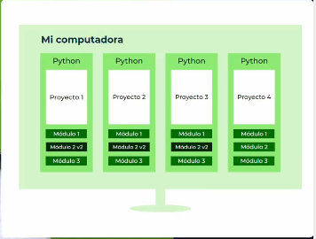
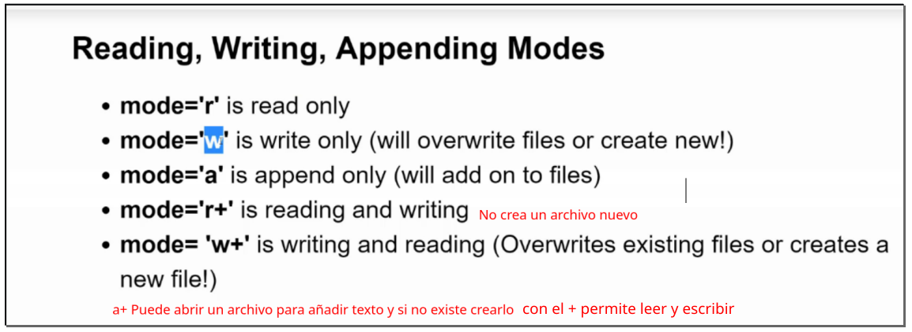

- [Course from zero to Hero - Udemy -](#course-from-zero-to-hero---udemy--)
  - [by Jose Portilla](#by-jose-portilla)
  - [by Andrei Neagoie](#by-andrei-neagoie)
- [Instalación de Python y SetUp](#instalación-de-python-y-setup)
  - [Instalación](#instalación)
  - [Instalamos el tema para Jupyter](#instalamos-el-tema-para-jupyter)
- [Introducción a Python](#introducción-a-python)
  - [Interpretes y virtual environment](#interpretes-y-virtual-environment)
    - [Interpretes](#interpretes)
    - [Virtual environment](#virtual-environment)
      - [Crear un entorno virtual](#crear-un-entorno-virtual)
    - [pip vs pip3](#pip-vs-pip3)
    - [Incompatibilidades pip y conda](#incompatibilidades-pip-y-conda)
    - [venv vs virtualenv](#venv-vs-virtualenv)
    - [virtualenv](#virtualenv)
      - [conda](#conda)
  - [Usos de python y librerías](#usos-de-python-y-librerías)
  - [Crear comentarios en Pyhon](#crear-comentarios-en-pyhon)
  - [Fundamental Data Types](#fundamental-data-types)
    - [**Algunas operaciones**](#algunas-operaciones)
      - [potencias](#potencias)
      - [Parte entera de una división decimal](#parte-entera-de-una-división-decimal)
      - [Resto de una división entera](#resto-de-una-división-entera)
    - [Funciones matemáticas](#funciones-matemáticas)
      - [**round**](#round)
      - [**abs**](#abs)
      - [**bin / int**](#bin--int)
  - [Uso de variables](#uso-de-variables)
  - [Uso del método print()](#uso-del-método-print)
  - [Ordered vs unordered](#ordered-vs-unordered)
  - [String](#string)
    - [**Propiedades de los strings**](#propiedades-de-los-strings)
    - [**Métodos de los strings**](#métodos-de-los-strings)
      - [**Slicing**](#slicing)
      - [**strip()**](#strip)
      - [**upper() lower() split()**](#upper-lower-split)
      - [**format**](#format)
      - [**Casefold**](#casefold)
      - [**find**](#find)
      - [**Capitalize**](#capitalize)
      - [**replace**](#replace)
      - [generar el alfabeto (inglés)](#generar-el-alfabeto-inglés)
  - [List - (data structure)](#list---data-structure)
    - [**Métodos**](#métodos)
      - [**len()**](#len)
      - [**Slicing**](#slicing-1)
      - [multiplicar elementos de una list](#multiplicar-elementos-de-una-list)
      - [concatenar list sumándolas](#concatenar-list-sumándolas)
      - [**Append() pop()**](#append-pop)
      - [**remove(element_value)**](#removeelement_value)
      - [**clear()**](#clear)
      - [**insert(index,value)**](#insertindexvalue)
      - [**extend([])**](#extend)
      - [**Sort() sorted() reverse()**](#sort-sorted-reverse)
      - [**Lista de elementos o comprehension**](#lista-de-elementos-o-comprehension)
      - [**Count()**](#count)
      - [**All() any()**](#all-any)
      - [**Join()**](#join)
      - [**Index(value,start,stop)/in**](#indexvaluestartstopin)
      - [**copy**](#copy)
      - [**List unpacking**](#list-unpacking)
  - [Dictionaries - dict (data structure)](#dictionaries---dict-data-structure)
    - [**Métodos**](#métodos-1)
      - [comprehension](#comprehension)
      - [get()](#get)
      - [**keys() / values() / items()**](#keys--values--items)
      - [**clear()**](#clear-1)
      - [**copy()**](#copy-1)
      - [**pop()**](#pop)
      - [**update()**](#update)
  - [Tuples data structure](#tuples-data-structure)
    - [**Métodos**](#métodos-2)
      - [**Count() / index()**](#count--index)
      - [**Sum()**](#sum)
  - [Sets - data structure -](#sets---data-structure--)
    - [**Métodos**](#métodos-3)
      - [**Add()**](#add)
      - [**clear() / copy()**](#clear--copy)
      - [difference()](#difference)
      - [discard()](#discard)
      - [difference_update()](#difference_update)
      - [intersection() o &](#intersection-o-)
      - [isdisjoint()](#isdisjoint)
      - [union() o |](#union-o-)
      - [issuperset()](#issuperset)
      - [**Issubset()**](#issubset)
- [In/Out with basic Files](#inout-with-basic-files)
  - [Crear un fichero - %%writefile](#crear-un-fichero---writefile)
  - [Abrir el fichero - open()](#abrir-el-fichero---open)
  - [Leer el fichero - .read()](#leer-el-fichero---read)
  - [seek()](#seek)
  - [readlines()](#readlines)
  - [close()](#close)
  - [With...as](#withas)
  - [open() - extendido](#open---extendido)
    - [**'a' (append) mode**](#a-append-mode)
    - [**w (write) mode**](#w-write-mode)
  - [File location](#file-location)
- [Operadores](#operadores)
  - [Aritméticos](#aritméticos)
  - [Asignación](#asignación)
  - [Comparación](#comparación)
  - [Lógicos](#lógicos)
  - [Identidad](#identidad)
  - [is vs '=='](#is-vs-)
    - [==](#)
    - [is](#is)
- [Condicionales e Iteraciones](#condicionales-e-iteraciones)
  - [If -elif-else statement](#if--elif-else-statement)
    - [**Ternary operator**](#ternary-operator)
  - [For loops](#for-loops)
    - [**While not**](#while-not)
  - [Keywords importantes en los loops](#keywords-importantes-en-los-loops)
    - [**Pass**](#pass)
    - [**Continue**](#continue)
    - [**Break**](#break)
- [Buil-in function útiles](#buil-in-function-útiles)
  - [Map(func,iterable)](#mapfunciterable)
  - [Filter(function, iterable)](#filterfunction-iterable)
  - [Reduce(function, iterable, [initial_value] )](#reducefunction-iterable-initial_value-)
  - [zip()](#zip)
  - [Lambda](#lambda)
  - [Range()](#range)
  - [enumerate()](#enumerate)
  - [In / not in](#in--not-in)
  - [Min() max()](#min-max)
  - [Random library](#random-library)
    - [**shuffle**](#shuffle)
    - [Randint](#randint)
  - [**Input**](#input)
    - [Validación input](#validación-input)
- [Methods and Functions](#methods-and-functions)
  - [Métodos](#métodos-4)
    - [**Argumentos vs parámetros**](#argumentos-vs-parámetros)
    - [**Tipos de argumentos**](#tipos-de-argumentos)
  - [Argumentos \*args (arguments) / \*\*kwargs(keywords arguments)](#argumentos-args-arguments--kwargskeywords-arguments)
      - [\*args](#args)
      - [\*\*kwargs(keywords arguments)](#kwargskeywords-arguments)
- [Scoope](#scoope)
  - [LEGB Rule](#legb-rule)
  - [global keyword](#global-keyword)
- [OOP - Object Oriented Programming](#oop---object-oriented-programming)
  - [Introspección de objetos](#introspección-de-objetos)
    - [isinstance() y issubclass](#isinstance-y-issubclass)
    - [dir()](#dir)
  - [Creación de una clase](#creación-de-una-clase)
    - [Añadimos los métodos](#añadimos-los-métodos)
      - [constructor **init**](#constructor-init)
  - [Características de la Programación Objetos](#características-de-la-programación-objetos)
    - [Encapsulación](#encapsulación)
    - [Herencia](#herencia)
      - [Herencia múltiple](#herencia-múltiple)
    - [Polimorfismo](#polimorfismo)
    - [Abstracción](#abstracción)
  - [Métodos especiales or magic methods or dunder methods](#métodos-especiales-or-magic-methods-or-dunder-methods)
    - [String representation **str()**](#string-representation-str)
    - [tamaño del objeto **len**](#tamaño-del-objeto-len)
    - [del method **del**](#del-method-del)
- [Functional Programing](#functional-programing)
  - [¿Que es?](#que-es)
- [Package and Advanced modules](#package-and-advanced-modules)
  - [Python Collections Module](#python-collections-module)
    - [Counter](#counter)
      - [Métodos](#métodos-5)
        - [elements()](#elements)
        - [values()](#values)
        - [sum()](#sum-1)
        - [clear()](#clear-2)
        - [list()](#list)
        - [most_common()](#most_common)
        - [list()](#list-1)
        - [set()](#set)
        - [dict()](#dict)
        - [.items()](#items)
        - [generar un Counter mediante una list de tuplas](#generar-un-counter-mediante-una-list-de-tuplas)
        - [c.most_common()[:-n-1:-1]](#cmost_common-n-1-1)
        - [c += Counter()](#c--counter)
        - [substract([iterable-or-mapping])](#substractiterable-or-mapping)
    - [namedtuple](#namedtuple)
    - [defaultdict](#defaultdict)
    - [OrderedDict](#ordereddict)
  - [Python OS and shutil Module](#python-os-and-shutil-module)
    - [os.getcwd (os)](#osgetcwd-os)
    - [os.listdir()](#oslistdir)
    - [os.unlink(path)](#osunlinkpath)
    - [os.rmdir(path)](#osrmdirpath)
    - [shutil.rmtree(path)](#shutilrmtreepath)
    - [send2trash(path)](#send2trashpath)
    - [os.walk()](#oswalk)
    - [shutil.move() (shutil)](#shutilmove-shutil)
  - [datetime module](#datetime-module)
    - [time()](#time)
    - [date()](#date)
    - [ctime()](#ctime)
    - [datetime from datetime](#datetime-from-datetime)
    - [.replace()](#replace-1)
  - [Math and random](#math-and-random)
    - [floor() / ceil() / round()](#floor--ceil--round)
    - [random.randint(low,hight)](#randomrandintlowhight)
    - [random.choice(list)](#randomchoicelist)
    - [random.choices()](#randomchoices)
    - [random.sample()](#randomsample)
    - [random.shuffle()](#randomshuffle)
  - [debugger](#debugger)
  - [regular expressions (regex)](#regular-expressions-regex)
    - [re.search()](#research)
    - [re.findAll() / re.finditer()](#refindall--refinditer)
    - [Creación de patrones regex](#creación-de-patrones-regex)
      - [Quantifiers](#quantifiers)
      - [compile](#compile)
      - [using or operator " | "](#using-or-operator---)
      - [wildcard operator " . "](#wildcard-operator---)
      - [find start with ' ' ^ ' and end with ' $ '](#find-start-with-----and-end-with---)
      - [excluir caracteres que empiecen [^ ] o que terminen [ $]](#excluir-caracteres-que-empiecen---o-que-terminen--)
      - [incluir caracteres](#incluir-caracteres)
      - [palabras que empiezan por un patrón en una frase](#palabras-que-empiezan-por-un-patrón-en-una-frase)
  - [Timing tu código](#timing-tu-código)
    - [Usando Time library](#usando-time-library)
    - [Usando timeit library](#usando-timeit-library)
  - [ZIP and UNZIP](#zip-and-unzip)
  - [PIP](#pip)
  - [PyPI (python package index)](#pypi-python-package-index)
  - [Escribiendo nuestros propios Módulos y paquetes](#escribiendo-nuestros-propios-módulos-y-paquetes)
    - [creando un módulo](#creando-un-módulo)
    - [creando un paquete](#creando-un-paquete)
  - [**name**](#name)
- [Decorators](#decorators)
  - [Que es un decorator](#que-es-un-decorator)
  - [First class citizens](#first-class-citizens)
  - [HOC - Higher Order Function](#hoc---higher-order-function)
  - [Decorators syntaxi](#decorators-syntaxi)
  - [Para que usamos los decorators](#para-que-usamos-los-decorators)
- [Errores y gestión de excepciones](#errores-y-gestión-de-excepciones)
  - [Lanzar nuestras propias excepciones](#lanzar-nuestras-propias-excepciones)
- [Unit testing](#unit-testing)
  - [Pylint](#pylint)
  - [unittest](#unittest)
- [Generators](#generators)
  - [Iteradores](#iteradores)
  - [Generadores](#generadores)
    - [next()](#next)
- [Web Scraping](#web-scraping)
  - [Reglas del web scraping](#reglas-del-web-scraping)
  - [Limitaciones de web scraping](#limitaciones-de-web-scraping)
  - [Setup para web scraping](#setup-para-web-scraping)
    - [instalar librerias necesarias](#instalar-librerias-necesarias)
  - [Grabbing el título de una web](#grabbing-el-título-de-una-web)
  - [Grabbing texto de una lista](#grabbing-texto-de-una-lista)
  - [Grabbing a img](#grabbing-a-img)
  - [Grabbing elements on multiple pages](#grabbing-elements-on-multiple-pages)
- [working with images](#working-with-images)
  - [Instalación](#instalación-1)
  - [Imagenes](#imagenes)
  - [Coger una sección de la imagen - cropping image](#coger-una-sección-de-la-imagen---cropping-image)
  - [copiar imagenes](#copiar-imagenes)
  - [resize de una imagen](#resize-de-una-imagen)
  - [rotar imagenes](#rotar-imagenes)
  - [Transparencias](#transparencias)

# Course from zero to Hero - Udemy -

## by Jose Portilla

> <span style="font-size:1.5em;"> [_link del curso_](https://www.udemy.com/course/complete-python-bootcamp/) </span>

## by Andrei Neagoie

> <span style="font-size:1.5em;"> [_link del curso_](https://www.udemy.com/course/complete-python-developer-zero-to-mastery/) </span>

# Instalación de Python y SetUp

## Instalación

Bajaremos un paqueta q se llama anaconda compuesto por python y una serie de librerías útiles junto con editores de texto como Jupiter. Lo bajamos desde

<span style="font-size:1em;">[_link anaconda.com_](https://www.anaconda.com/distribution/)</span>

1. Vamos a en nuestro direcotrio
2. Ejecutamos el archivo descargado en el link

```
  bash Anaconda3-5.2.0-Linux-x86_64.sh
```

   Durante la instalación nos va a preguntar:

   The installer prompts “Do you wish the installer to initialize Anaconda3 by running conda init?”

   Se recomienda poner [yes]

   si le damos a no hay q hacer los siguiente para iniciar anaconda:

```
source /home/david/anaconda3/bin/activate

conda init

```

```
  source .bashrc
```

3. Comprobamos que se ha instalado adecuadamente  
   
4. Lanzamos interfaz gráfica de Anaconda

```
    anaconda-navigator
```

5. Para ver info de anaconda

```
    conda info
```


6. Vemos como en el prompt pone base eso es xq es el interprete de anaconda para desactivarlo

```
  conda deactivate
```

   para volverla a activar

```
conda activate

```
   Una vez instalado anaconda cada vez que abramos una nueva terminal se activará por defecto el entorno viertual conda, para prevenir esto podemos usar el siguiente comando 
   
```
conda config --set auto_activate_base false
```

1. Saber versión y donde está instalado python  
   
1. Añadir PYTHONPATH
   Abrir en nuestra carpeta personal el archivo .bashrc y al final del archivo añadir lo q nos devuelve which python

   

1. Ahora cuando tecleamos

   

Y nos tiene q dar la misma respuesta.

Para actualizar anaconda

```
conda deactivate
```

```
conda update anaconda
```

```
conda update anaconda-navigator
```
Si queremos instalar python fuera de anaconda podemos hacerlo con nuestro getsor de paquetes

primero miramos q version tenemos ya instalada

```
python3 --version
```
actualizamos e instalamos

```
sudo apt update
sudo apt install python3.9
```
ahora tenemos que añadir la antigua version de python3 a la update-alternatives

```
sudo update-alternatives --install /usr/bin/python3 python3 /usr/bin/python3.[old-version] 1
```
y añadimos la nueva 
```language
sudo update-alternatives --install /usr/bin/python3 python3 /usr/bin/python3.9 2
```
y ahora podemos escoger qué versión queremos de python3 se por defecto

```
sudo update-alternatives --config python3
```

```
python3.9 -m test

```

## Instalamos el tema para Jupyter

Source https://github.com/dunovank/jupyter-themes
https://medium.com/@rbmsingh/making-jupyter-dark-mode-great-5adaedd814db

1. actualizamos anaconda

   ```bash
   conda update anaconda
   ```

2. instalamos los temas

   ```bash
     pip install jupyterthemes
   ```

   ```bash
     pip install --upgrade jupyterthemes
   ```

3. Seleccionamos monokai  
   
4. Modificamos el tema
   Con esa modificación los ejes de los gráficos se ven mal para rectificarlo:
   Make a file named 00_startup.py in ~/.ipython/profile_default/startup and stick the following snippet into it, and restart Jupyter, details are here
   import os
   import pandas as pd
   import numpy as np
   import matplotlib.pyplot as plt
   import seaborn as sns
   from jupyterthemes import jtplot
   jtplot.style(theme=’monokai’, context=’notebook’, ticks=True, grid=False)

# Introducción a Python

## Interpretes y virtual environment

### Interpretes

Podemos tener instaldos diferentes interpretes de python (versiones prython2, python3.x..) cada uno de estos interpretes se instala en distintos lugares de nuestro SO


Cuando seleccionamos un interprete se crea un archivo setting.json donde se guardan los settings de nuestro proyecto, y entre esa info está dnd se encuentra el interprete q estamos usando para ese proyecto.


Si en terminal tecleamos:

```python
which python3 # /home/david/anaconda3/bin/python3
```

Nos dará dónde está instalada la versión de python que usamos por default

En los settings de vscode podemos añadir esta info para cualquier archivo .py use este interprete.


### Virtual environment

Podemos crear un entorno virtual para cada proyecto de python. Un entorno virtual es una herramienta que ayuda a mantener separadas las dependencias requeridas por diferentes proyectos. Estos ebtornos virtuales están aislados unos de otros.



es como tener un oython aislado con sus propios módulos para cada proyecto.


Imagine un escenario en el que está trabajando en dos proyectos web Python y uno de ellos usa Django 1.9 y el otro usa Django 1.10. En tales situaciones, el entorno virtual puede ser realmente útil para mantener las dependencias de ambos proyectos separadas y tener diferentes versiones de las librerias xa cada proyecto.

Realmente cuando creamos un entorno virtual instalamos un interprete de python en una localización concreta y se reescribe el PATH haciendo que cuando usemos el comando python, éste empiece a buscar el intérprete de por la carpete de venv del proyecto. Para comprobar esto podemos hacer `echo $PATH `

Hay que tener en cuenta que cuando creamos un venv este usa la versión del interprete por defecto que tenemos instalado globalmente. Si tenemos varias versiones de python3.4 y python3.6, podemos querer utilizar una u otra según el proyecto para escoger podemos usar el programa `pyenv`.

```
$ brew update
$ brew install pyenv
```

https://www.freecodecamp.org/news/manage-multiple-python-versions-and-virtual-environments-venv-pyenv-pyvenv-a29fb00c296f/


#### Crear un entorno virtual

Para poder crear un entorno virtual debemos instalar en el sistema python3-venv

```
sudo apt-get install python3-venv
```

1. Para poder usar virtual environment debemos instalar el paquete `virtualenv`

```
pip install virtualenv
```

Para saber qué paquetes tenemos instalados de manera global, primero debemos salir del entorno virtual (por ejemplo `conda deactivate`) y teclear:

```
pip3 list
```

o

```
conda list
```

Si dentro de un entorno virtual damos esa orden nos listará los paquetes asociados a ese entorno.

Anaconda tiene su propio gestor de paquetes llamado conda, pip es otro gestor de paquetes.

2. nos dirigimos a la raíz de nuestro proyecto

```
python3 -m venv nombre_del_proyecto_venv
```

este comando llama al mòdulo (-m) con nombre (venv) y después pasa un nombre para el entorno.

esto crea un directorio con el nombre especificado.


> Por convención primero se crea el directorio de nuestro proyecto y dentro de éste se genera el entorno virtual

```
$ mkdir New_project

$ python3 -m venv New_project/venv
```

y nos quedaría así:


El resto de archivos de nuestro proyecto **no los pondremos** nunca dentro de nuestro directorio `venv` Porque el entorno virtual es algo que podemos eliminar y volver a crear.


Una cosa importante a tener en cuenta es que al crear el entorno virtual éste usará el interprete en la versión de python que estemos usando en ese momento, así que si queremos usar diferentes versiones del interprete de python que tengamos instalado debemos especificarlo cuando creamos el entorno.

```
python3.8 -m venv nombre_del_proyecto_venv
```


```
(venv) david@david-neon:~/Documentos$ which python
/home/david/Documentos/New_project/venv/bin/python

(venv) david@david-neon:~/Documentos$ python --version
Python 3.8.5
```

Por defecto en este entorno no tendremos instalado ningún módulo aunque el gestor de paquetes pip si estará instalado aunque se recomienda actualizarlo `pip install --upgrade pip`.

Una vez creado nuestro entorno virtual e instalado nuestras dependencias, podemos querer reproducir el mismo proyecto en otro entorno virtual pero conservando todas esas dependencias para q el proyecto funcione bien para ello usaremos el comando

```
pip freeze
```

que genera un output susceptible de ser tranformado en un archivo de requerimientos, podemos crear un archivo tipo txt con esa info


para ello:

```
pip freeze > requeriments.txt
```

Una vez tenemos este archivo podemos crear un nuevo entorno virtual en otro lugar y cargar esas dependencias

```
pip install -r requeriments.txt
```

1. Para activar ese entorno

```
source prueba_python/bin/activate
```

4. Para salir de este entorno hacemos

```
$ deactivate
```

5. si hacemos ahora un pip list veremos que solo tenemos instalado pip y setuptools


6. Si queremos eliminar un entorno virtual solo es necesario borrar la carpeta del entorno

Otra cosa importante es que podemos crear un entorno virtual con acceso a las librerias instaladas globalmente, auqnue una alternativa es hacer un requeriments.txt con las librerias globales q nos interesan y cargarlo en el proyecto.

Para generar un entorno virtual con acceso a librerias globales hacemos:

```
python3 -m venv proyecto/venv --system-site-packages
```

Ahora bien todo lo que instalemos en este entorno virtual no afectará al global. Para listar los paquetes locales:

```
pip list --local
```

y tb podemos hacer un freeze local

```
pip freeze --local > requeriments.txt
```

Cuando se crea un entorno virtual con venv se crea en la raíz del entorno un archivo `pyvenv.cfg` con la configuración del entorno.


### pip vs pip3

De manera global, en mi equipo tengo instalado python3 que funciona con pip3, si tuviera instalado python2 debería usar pip2.
Ahora bien en el entorno virtual de anaconda puedo usar pip, a secas sin especificar versión, eso es pq pip en anaconda se adapta al contexto si estamos en un interprete de python3 pip hará referencia a python3, usará pip3.

Por ese motivo pip fuera del entorno virtual anaconda (base) NO funciona y debo usar pip3

```
david@david-neon:~/Documentos/prueba_python/prueba_python$
pip3 freeze | grep six

six==1.14.0
```

### Incompatibilidades pip y conda

Siempre que sea posible deberemos utilizar comandos de conda cuando estemos en un entorno de anaconda. Puede que si usamos el gestor de paquetes pip con conda nos dé errores así que mejor usar el gestor conda. En el caso que debamos usar pip deberemos crear un nuevo entorno dentro de conda para usar pip.

### venv vs virtualenv

Ambas herramientas se usan para crear entornos virtuales, venv está incluido en python3 mientras virtualenv se instala con pip3. Hay q decir que venv es un subset de virtualenv por lo que está mś limitado.

### virtualenv

Si vamos a usar virtualenv lo debemos instalar de manera global

```python
pip3 install virtualenv
```

Para crear un entorno, lo más sencillo

```
virtualenv my-env
```

podemos añadir versión de python deseada ruta del entorno y que pueda acceder a paquetes globales

```
virtualenv  --python=/usr/bin/python2.7 my-directory/new-venv5 --system-site-packages
```

A partir de aquí igual que antes.

#### conda

Si usmaos conda, hay que tener en cuenta que todos los entornos virtuales se guardan en el directorio por defecto de anaconda
`/home/david/anaconda3/envs/* `

1. crear entornos

```
conda create --name myenvironment
```

especificando versoin de python

```
conda create --name myenvironment python=3.7
```

1.1 crear entornos from file requeriments.txt

```
conda create --name myenvironment --file requirements.txt
```

1.2 Especificando una ruta para el entorno

```
conda create --prefix /some/path/to/env

conda create -p /some/path/to/env
```

lo que crea dos problemas:

el promp se hace demasiado largo


para solucionarlo

```
conda config --set env_prompt '({name}) '
```

Ese comando modifica o crea un archivo de configuración de conda en nuestro directorio de usuario llamado .condarc

para instalar paquetes sin el entorno activado hay q especificar la ruta en nugar del nombre usando --prefix

En una situación normal, entorno creado en el directorio x defecto de anaconda (/home/david/anaconda3/envs/) cno el flag --name es suficiente

```python
conda install --name conda-env pandas
```

si está en otro directorio

```python
conda install --prefix /home/david/Documentos/New-project-7/venv pandas
```

2. activar/desactivar el entorno

```
conda activate myenvironment
conda deactivate
```

Si está en un path fuera del por defecto de conda

```
conda activate ./venv-django-project
```

3. Listar todos los entornos

```python
conda info -e
```

4. Freeze the current environment into requirements.txt:

```python
conda list --export > requirements.txt
```

5. Freeze the current environment into environment.yml:

```python
conda env export > environment.yml
```

6. To clean unnecessary cached files (which grow quickly over time):

```python
conda clean
```

7. Para eliminar entornos de anaconda

```python
conda env remove --name my-env2
```

o

```python
conda env remove --prefix /home/david/Documentos/New-project-7/venv
```

8. si quisierams cambiar el nombre del entorno

```python
conda create --name <new_name> --clone <old_name>
conda remove --name <old_name> --all
```

> Todo esto se puede gestionar de manera grafica con la GUI de conda-navgator

## Usos de python y librerías


Para poder ejectar código python necesitamos un intérprete que lee línea a línea nuestro código y una viertual machine. Si lo bajamos de la web oficial ambos estarán escritos en C por eso se llama c-virtual machine y cpython.


## Crear comentarios en Pyhon

```python
  # comentario monolínea
  '''
    comentario de bloque
  '''
```

Las 3 comillas tb pueden servir para escribit un string de múltiples líneas, así q lo adecuado en py para comentarios de múltiples líneas es usar # antes de cada una

## Fundamental Data Types

Son los tipos especificados en el core de python tales como :  


Tenemos otros tipos de datos como:

- ### **Custom Types - Class**
  Podemos crear nuestros propios tipos de datos, para ello construimos clases.
- ### **Specialized Data Type**
  Son aquellos que están especificados en paquetes externos, los llamados `modules`.
- ### **None - type**
  Indica ausencia de valor

### **Algunas operaciones**

#### potencias

```python
# para hacer potencias de un número
print(2**3) # 8
```

#### Parte entera de una división decimal

trunca los decimales, no redondea!
```python
# Para obtener la parte entera de una división decimal //

print(2//4 ) # 0 => 0.5
print(5//4 ) #  1  =>1.25
```

#### Resto de una división entera

```python
# Para obtener el resto de la división entera es el módulo %

print(5 % 4) # 1
print(6 % 4 )# 2
```

### Funciones matemáticas

#### **round**

Permite redondear el número

```python
round(3.1) # 3
round(3.9) # 4
```

#### **abs**

Obtener el valor absolute de un valor

```python
abs(3)  # 3
abs(-3) # 3
```

#### **bin / int**

representación binaria bin()

```python
bin(5) # '0b101'
```

Pasar un número en base 'x' a integer (base 10).
El método funciona como: este número '0b101' en base 2 (binaria) pásalo a int

```python
int('0b101', 2) # 5
```

## Uso de variables

Hay q tener claro que en python no hay tipos primitivos, todo el python son objetos!

Python usa tipado dinámico como JavaScript esto significa que no es necesario especificar el tipo de dato que contendrá dicha variable.
Por ejemplo Java tiene un tipado estático porque requiere que especifiquemos durante la declaración el tipo de dato que contendrá la variable.  
 Podemos usar `type()` para saber el tipo de variable  
 Usamos la función `str()` para **castear** a string, lo que llamamos `type conversion`. Podemos usar `int()` `float()` `bool` ...

```python
  # Tipado dinámico

  my_dogs = 2

  print('tipo de mi variable ' + str(type(my_dogs))) # tipo de mi variable <class 'int'>

  my_dogs = ['sammy','frankie']

  print('mi variable ha cambiado de tipo, ahora es una list ' + str(type(my_dogs)) +' -> ' +str(my_dogs))
  # mi variable ha cambiado de tipo, ahora es una list <class 'list'> -> ['sammy', 'frankie']

  # type conversion

  number = 5
  name = 'david'
  print(name+number) # eso da error
  print(name+str(number))
```

## Uso del método print()

Para imprimir contenido usamos el método print(), éste acepta un atributo para indicar que no haga salto de página end=’’.

```python
  for x in range(10):
    print(x, end='')

  # 0123456789
```

## Ordered vs unordered

Por ejemplo una `list` es un objeto **ordenado** y un `dict` es un objeto **desordenado** (en python todo son objetos). El concepto ordenado/desordenado hace referencia a como se almacena la info en memoria.
Los elementos de una lista se guardan en memoria uno al lado del otro tal como los vamos especificando, pero n una dict los elementos se guardan en diferentes puntos de la memoria. Si hacemos un dict pequeño

```python
      user = {
        'nombre':'dabid',
        'edad':36
      }
```

y lo imprimimos probablemente los campos se impriman cn ese orden pero diccionarios de mayor tamaño muy probablemente los campos se presenten en distinto orden.

## String

Funcionan como arrays así que usando el índice podemos extraer letras del string.
Está habilitado el reverse index(indice reverso) así sin conocer la longitud del string podemos extraer el último carácter(poner el índice en negativo: -1).

```python
  my_name = "david"
  my_name[0] # 'd'
  my_name[1] # 'a'
  # len() function

  print('utilizando la función len() => '+my_name[len(my_name)-1])

  # utilizando la función len() => d

  # última letra sin saber la longitud del str

  # Reverse index

  print('utilizando el indice reverso => '+my_name[-1])
  #utilizando el indice reverso => d
```

Tamaño de un str usamos la función len()

### **Propiedades de los strings**

- 1. Son inmutables, no podemos modificar un string

     ```python
       name = 'David'
       name[0]= 'P'

       # 'str' object does not support item assignment por lo tanto strings inmutables
     ```

- 2. Concatenables, solo funciona con strings no le puedo concatenar un número, para ello debo castearlo a `str` previamente

     ```python
       x = "hello world"

       y = ' is beatifull outside'

       x+= y
       print(x) #hello world is beatifull outside

       name = 'David'

       name = 'P'+ name[1:]
       name #'Pavid'

       number = 5
       name = 'david'
       print(name+number) # eso da error
       print(name+str(number)) # david5

     ```

- 3. Multiplicables

     ```python
      name = 'd'

      name\*10 # dddddddddddd

     ```

### **Métodos de los strings**

#### **Slicing**

- [start:stop:step] nos permite obtener un subString  
   stop - indica hasta dnd se extrae pero sin incluir ese caracter  
   step - divide en str en grupos de X carcateres y nos devuelve el
  primer caracter de cada grupo

  ```python
    # slicing [start:stop:step]

        my_string = "abcdefghijk"

        print(' substring desde el índice 0 hasta el final [::] => '+my_string[::])
        print(' substring desde el índice 2 hasta el final => '+my_string[2:])
        print(' substring desde el índice 0 hasta el índice 3 (NO incluido)) => '+my_string[:3])
        print(' substring desde el índice 2 hasta al 5(No incluido) => '+my_string[2:5])

        # uso del tercer parámetro, divide en str en grupos de X carcateres y nos devuelve el primer caracter de cada grupo

        # por ejemplo si ponemos 2 ab - cd - ef - gh - ij - k null

        print(' substring dividido en grupos de a 2 => '+my_string[::2])

        # por ejemplo si ponemos 3 abc - def - ghi - jk null

        print(' substring dividido en grupos de a 3 => '+my_string[::3])

        # lo mismo pero de un subString cd - ef

        print(' substring del 2 al 5 dividido en grupos de a 2 => '+my_string[2:6:2])

        # utilizando el 3 como negativo -1 invierte el string kjihgfedcba

        print('separador de grupo en - empieza por el final(INVIERTE EL STRING) => '+my_string[::-1])

        # utilizando el 3 como negativo -1 Ab - Cd - Ef - Gh - Ij - K null <-

        print(' usando el separador de grupo en - empieza a contar por el final=> '+my_string[::-2])

        '''
            substring desde el índice 0 hasta el final [::]              => abcdefghijk
            substring desde el índice 2 hasta el final                   =>   cdefghijk
            substring desde el índice 0 hasta el índice 3 (NO incluido)) => abc
            substring desde el índice 2 hasta al 5(No incluido)          =>   cde
            substring dividido en grupos de a 2                          => acegik
            substring dividido en grupos de a 3                          => adgj
            substring  del 2 al 5 dividido en grupos de a 2               => ce
            separador de grupo en - empieza por el final(INVIERTE EL STRING) => kjihgfedcba
            usando el separador de grupo en - empieza a contar por el final=> kigeca
        '''
  ```

#### **strip()**

Permite eliminar los espacios en blanco por delante y detrás de un string (inicio y final de una frase) o los caracteres que indiquemos, no importa el orden de los caracteres. Puede aceptar como argumento los caracteres a eliminar

```python
string = '  xoxo love xoxo   '

# eliminamos los espacios en blanco
print(string.strip()) # 'xoxo love xoxo'

# los siguientes caracteres serán eliminados
#  <whitespace>,x,o,e
# empieza por espacio en blanco? sí elimina el whitespace
# temina en x | o | e ? pues va eliminando por detrás hasta q no termine en ningna de las combinaciones de xoe
print(string.strip(' xoe'))  #lov

# el argumento no contiene espacios en blanco
#ni ningún otro caracter coincidente en el string
# así q el string se mantiene igual
print(string.strip('stx')) #  xoxo love xoxo

string = 'android is awesome'
print(string.strip('an')) # droid is awesome

string = 'android is awesonaan'
print(string.strip('an')) # droid is aweso

```

#### **upper() lower() split()**

```python
    x = "hi this is a string"
    print(x.upper()) #HI THIS IS A STRING
    print(x.lower()) #hi this is a string
    print(x.split()) #['hi', 'this', 'is', 'a', 'string']
    print(x.split('i')) #['h', ' th', 's ', 's a str', 'ng']
```

#### **format**

```python
print('hello {}'.format('world')) #hello world

name= 'David'
apellido1 = 'Martin'
apellido2 = 'Vergues'

print('me llamo {} {} {}'.format('David', 'Martin', 'Vergues'))
#me llamo David Martin Vergues

print('me llamo {2} {1}, {0}'.format('David', 'Martín', 'Vergues'))
#me llamo Vergues Martín, David

#podemos especificar el número de caracteres q ocupara cada string y si cómo estará alineado

print('alineación: {0:<15} {1:^15} {2:>15}'.format('izq', 'centro', 'drcha'))
# izq                 centro                drcha
# 0 el primer valor 'izq'
# < indica hacia la izq
# 15 número de esacios a ocupar

print('alineación: {0:=<15} {1:-^15} {2:.>15}'.format('izq', 'centro', 'drcha'))
# alineación: izq============ ----centro----- ..........drcha

#podemos usar keyword
print('me llamo {v} {m}, {d}'.format(d='David', m='Martín', v='Vergues'))
#me llamo Vergues Martín, David

#podemos usar referencias a variables
print('me llamo {2} {1}, {0} y tengo {3}'.format(name,apellido1,apellido2, '35'))
#me llamo Vergues Martin, David y tengo 35

#podemos truncar los strings con la notación del punto
print('me llamo {0:.3} '.format(name)) #me llamo Dav
```

- ##### Float formatting

  {value:width.precision f}  
   Value => ponemos el valor del número  
   Width => tamaño que ocupará el número hecho string (nº de caracteres)  
   Precision => número de decimales que tendrá

  ```python
  result = 1.2987012987012987

  print('mi valor es {r:1.3f}'.format(r=result))
  #mi valor es 1.299
  print('mi valor es {r:10.3f}'.format(r=result))
  #mi valor es      1.299
  ```

- ##### f-string = formated string literal

  ```python
  name = "David"
  age = 3
  print(f'hello, his name is {name} and he is {age} years old')
  # hello, his name is David and he is 3 years old

  result = 1.459029
  result2 = 1.45

  print(f'este es mi resultado => {result:1.2f}')
  # este es mi resultado => 1.46

  print(f'este es mi resultado => {result2:1.4f}')
  # con notación de .format() este es mi resultado => 1.4500

  print(f'este es mi resultado => {result2:<{10}.{3}}')
  # con notación de f-string este es mi resultado =>  1.45

  print(f'este es mi resultado => {result2:^{10}.{3}}')
  # con notación de f-string este es mi resultado =>    1.45
  ```

  {3} En este caso hace referencia al número total de dígitos que tendrá el número, no como en .format() que hace referencia al número de dígitos decimales

#### **Casefold**

- Es como un equalsIgnoreCase de java, elimina las distinciones entre mayúsculas y minúsculas en el momento de comparar strings.

  ```python
    str1 = 'david'
    str2 = 'DAVID'

    if str1 == str2:
      print('son iguales')
    else:
      print('son diferentes')
    # son diferentes
  ```

  usando casefold()

  ```python
    str1 = 'david'
    str2 = 'DAVID'

    if str1 == str2.casefold():
      print('son iguales')
    else:
      print('son diferentes')
    # son iguales
  ```

#### **find**

- Sólo funciona en estrings, para saber si un string contiene a otro y si lo está nos devuelve la posición y si no un -1. Hace distinción entra minusculas y mayúsculas.

  ```python
    str1 = 'david'
    str2 = 'hello david'

    str2.find(str1) #6
    str2.find('ello') #1
    str2.find('Hello') #-1
  ```

#### **Capitalize**

- La primera letra de una palabra en mayúscula.

  ```python
    def old_macdonald(name):
        first_part = name[:3]
        second_part = name[3:]

        return first_part.capitalize()+second_part.capitalize()

    old_macdonald('macdonald') #'MacDonald'
  ```

#### **replace**

- reemplazar partes del texto.

```python
       quote= 'to be or not to be'
       print(quote.replace('be','me'))
       # to me or not to me
```

#### generar el alfabeto (inglés)

importamos la librerio string

```python
import string

string.ascii_lowercase
#'abcdefghijklmnopqrstuvwxyz'
```

`Aplicando todos estos métodos sobre un string nunca alteramos el string original, son inmutables!, pero podemos asignar el resultado a una nueva variable`

## List - (data structure)

Secuencia ordenada de elementos que pueden ser de diferentes tipos(numbers, string,obj...). Podemos tener distintos tipos de datos almacenados en un list. Las listas en python son dinámicas podemos modificarlas.

### **Métodos**

#### **len()**

- Conocer el número de elementos de la list.

```python
    my_List = []

    my_List = ['string', 100, 20.3,1,2,3]

    # len()
    len(my_List)
```

#### **Slicing**

- [start:stop:step]  
  Funciona igual que en los strings. No altera el array original pero devuelve un nuevo array.

```python
    my_List[-1]     # 3
    my_List[4:]     #  [2, 3]
    my_List[:3]     #  ['string', 100, 20.3]
    my_List[::2]    #  ['string', 20.3, 2]
    my_List*2       # ['string', 100, 20.3, 1, 2, 3, 'string', 100, 20.3, 1, 2, 3]
```
#### multiplicar elementos de una list

```python
lista = [1,2,3,4,5]

lista *=3
lista # [1, 2, 3, 4, 5, 1, 2, 3, 4, 5, 1, 2, 3, 4, 5]
```


#### concatenar list sumándolas

```python
    my_list_1 = [1,2,3,4,5]
    my_list_2 = [6,7,8,9,10]

    my_list_1+=my_list_2

    my_list_2 # [6, 7, 8, 9, 10]
    my_list_1 # [1, 2, 3, 4, 5, 6, 7, 8, 9, 10]
```

#### **Append() pop()**

- Nos permite añadir(append) o eliminar (pop) un elemento al final de la list.
  El método pop() no solo elimina el último elemento sino que también lo devuelve. Una función más es que puedes pasar el índice del elementos a eliminar, por defecto es el -1 (último elemento).
  A pop le podemos pasar el índice del elemento a borrar.

```python
    my_list = ['one', 'two','three','four','five','six']

    my_list.append('eight')

    my_list # ['one', 'two', 'three', 'four', 'five', 'six', 'eight']

    element_deleted = my_list.pop()

    element_deleted # 'eight'

    my_list # ['one', 'two', 'three', 'four', 'five', 'six']

    my_list.pop(0) # 'one'
    my_list         # ['two', 'three', 'four', 'five', 'six']
```

#### **remove(element_value)**

- Nos permite borrar un elemento de a lista especificando el valor de dicho elemento. Cambia nuestra list, no devuelve el valor eliminado como sí lo hace pop()

```python
    list2 = ['david','martin','vergues']
    list2.remove('david')
    print(list2)   # ['martin', 'vergues']
```

#### **clear()**

- Vacia la lista

```python
    list2 = ['david','martin','vergues']
    list2.clear()
    print(list2)
```

#### **insert(index,value)**

- Nos permite introducir un elemento en la lista en un índice concreto

```python
    list = [1,2,3,4]
    list.insert(4,100)
    print(list) #[0, 1, 2, 3,4,100]

    list2 = [1,2,3,4]
    list2.insert(0,5)
    print(list2) # [5, 1, 2, 3, 4]
```

#### **extend([])**

- Permite extender el array con nuevos elementos necesitamos pasarlos como un iterable, en lugar de hacer 'x' appends.

```python
    list2 = [1,2,3,4]
    list2.extend([0,5])
    print(list2) # [1, 2, 3, 4, 0, 5]
```

#### **Sort() sorted() reverse()**

- sort() y reverse() actúan sobre la list y la modifican

```python
    char_list = ['a','d','c','e','f','b']
    num_list = [10,2,4,1,0]

    char_list.sort()
    num_list.reverse()

    print(char_list) # ['a', 'b', 'c', 'd', 'e', 'f']
    print(num_list)  # [0, 1, 4, 2, 10]
```

El método sorted() devuelve la lista ordenada pero no modifica la original.

```python

  list4 = [5,3,4,6,1]

  listOrdenada = sorted(list4)

  print(list4)        # [5, 3, 4, 6, 1]
  print(listOrdenada) # [1, 3, 4, 5, 6]
```

Tanto a sort() o sorted podemos indicar en base a que elemento se hace la ordenación y si queremos q sea reversa. Siempre que el iterable sea una tupla o un dictionari

```python
student_tuples = [
    ('john', 'A', 15),
    ('jane', 'B', 12),
    ('dave', 'B', 10),
]

sorted(student_tuples, key=lambda student: student[2])
# sort by age
#   [('dave', 'B', 10), ('jane', 'B', 12), ('john', 'A', 15)]
```

si queremos modificar la list original

```python
student_tuples.sort(key=lambda student: student[2])   # sort by age

```

#### **Lista de elementos o comprehension**

- Si quisiéramos obtener una lista de las letras que forman un string podemos hacer lo siguiente:

  ```python
    word = 'word'

    l = []

    for letter in word:
        l.append(letter)

    print(l) # ['w', 'o', 'r', 'd']
  ```

  Pero una manera de hacerlo más fácil es:
  subelement **for** subelemento **in** element

  ```python
    word = 'word'

    l = [letter for letter in word]

    l # ['w', 'o', 'r', 'd']
  ```

- Range

  ```python
    l=  [num for num in range(0,10)]
    l # [0, 1, 2, 3, 4, 5, 6, 7, 8, 9]
  ```

  También podemos hacer lo siguiente:

  ```python
    new_list = list(range(100))
  ```

- Podemos aplicar cambios a cada subelemento antes de incluirlo en la list, por ejemplo hacer el cuadrado de cada elemento **num** \*\*2

  ```python
    l=  [num**2 for num in range(0,10)]
    l # [0, 1, 4, 9, 16, 25, 36, 49, 64, 81]
  ```

  Podemos añadir condiciones

  ```python
    l=  [num**2 for num in range(0,10) if num%2 ==0]
    l # [0, 4, 16, 36, 64]

  ```

  incluso if else

  ```python
    l=  [num if num%2==0 else 'impar' for num in range(0,10)]
    l # [0, 'impar', 2, 'impar', 4, 'impar', 6, 'impar', 8, 'impar']

  ```

  Incluso podemos añadir operaciones

  ```python
    celcius = [0,10,20,34.5]

    fahrenheit = [ ((9/5)*temp+32) for temp in celcius ]

    fahrenheit #[32.0, 50.0, 68.0, 94.1]

  ```

  ```python
    s = ['a','b','c','b','d','m','n','n']

    l = list({ c for c in s if s.count(c)>1 })

    l # ['b','n']
  ```

  Todo lo visto hasta aquí pemite crear una lista de una manera sencilla pero si sustituimos los `[]` por `()` en lugar de una lista obtenemos un `generator`.

- Nested loops

  ```python
    l = []

    for x in [2,4,6]:
        for y in [1,10,100]:
            l.append(x*y)
    l # [2, 20, 200, 4, 40, 400, 6, 60, 600]
  ```

#### **Count()**

- Las veces q aparece un elemento en una lista

  ```python
    l = [0,2,2,10,20,34.5]

    print(l.count(2)) # 2
  ```

#### **All() any()**

- Nos permite saber si una lista contiene todos (all) los valores o sólo algunos (any) de otra lista

  ```python
    l1 = [1,2,3]
    l2 = [1,2,3,4,5,6]
    l3 = [1,2,45,6,8]
              (2)               (1)
    r = all(element in l2 for element in l1)
    r #true

    r = all(element in l3 for element in l1)
    r #false

    r = any(element in l3 for element in l1)
    r #true

  ```

  La secuencia de comprobación es la siguiente:  
  primero hace un for (1) sacando cada “elem” de l1 y hace la comprobación en elem in l2 (2)

  any/all tb puede usarse para evaluar una lista de la soguiente manera

  ```python
  any(p<0 for p in [1,2,3,4,5]) # FALSE
  all(p>0 for p in [1,2,3,4,5]) # True
  ```

#### **Join()**

- Permite concatenar los elementos de una lista mediante algún caracter, por ejemplo un espacio en blanco

  ```python
    l = ['hola','david']

    ' '.join(l) # 'hola david'

  ```

#### **Index(value,start,stop)/in**

- Nos devuelve la posición de una valor en la list, el primero que encuetra

  ```python
    l1 = [1,2,3]
    l1.index(3) # 2
  ```

  Podemos pasar parámetros adicionales, como el índice dónde empezamos a buscar y el índice dónde paramos la búsqueda

  ```python
  list5 =  ['a','b','c','d','e','f']

  print(list5.index('e',3,5)) # 4

  ```

  Cuando busco un valor que no existe en la lista este método me arroja un error

  ```python
    list5 =  ['a','b','c','d','e','f']

    print(list5.index('x',3,5)) # error
  ```

  

- Para evitar este error usaremos la `keyword` `in` que nos permite saber si un valor está en una list o tb funciona con str.

  ```python
    list5 =  ['a','b','c','d','e','f']
    print('x' in list5) # False

    # en str

    print('d' in 'David') # True
  ```

#### **copy**

- Hace una copia de la lista. Nos crea una nueva list. Pero... si esta lista contiene n objeto (otra lista, dictionary,...) no genera uno nuevo si no que `copia la referencia` así si modifico valores de ese objeto en la nueva lista en la lista original quedan modificados también.

  ```python
    list5 =  ['a','b','c','d','e','f', [1,2,3], {'fruta':'manzana','precio':5}]
    list6 = list5.copy()
    print(list5)
    list6[6][0]=0
    list6[0]='x'
    print(list5)
    print(list6)
  ```

  

#### **List unpacking**

- Nos permite extraer valores de una lista de diferentes modos

  a,b,c, \*other, d = [1,2,3,4,5,6,7,8,9]

  print(a) #1
  print(b) #2
  print(c) #3
  print(other) # [4, 5, 6, 7, 8]
  print(d) # 8

## Dictionaries - dict (data structure)

Es una manera de mantener nuestros datos estructurados (`data structure`)

Son mapas desordenados (no pueden ser ordenados) para almacenar objetos usando los pares **clave-valor**.
Normalmente los usamos cuando queremos tener dos valores que están relacionados por ejemplo precios de productos, así no necesitamos saber el índice del producto para saber el precio.  
La clave de los diccionarios debe ser un elemento `inmutable`. Por lo que podemos usar booleans, num,... pero no una list. Aunque el 99 % de las veces la clave será un string.
Otro punto es que las claves deben ser únicas, si se repiten serán sobreescritas por la última.

```python
d = {
      123:[1,2,3],
      True:[1,2,3],
      [100]: True # este nos dará error
      }
```

Otra manera de crear dictionaries, no muy común, es usando una in-built function `dict()`

```python
      user2 = dict(name='Laura')
      user2 #
```

Para acceder los valores se utiliza el corchete con la clave

```python
      prices_lookup = {
        'apple':2.88,
        'oranges':3.56,
        'milk':6.12
       }

      print('precio de las manzanas {:<10.5f} €'.format(prices_lookup['apple']))
      # precio de las manzanas 2.88000    €

      prices_lookup # {'apple': 2.88, 'oranges': 3.56, 'milk': 6.12}

```

Dentro de los diccionarios podemos almacenar listas y otros diccionarios.

```python
      d = {
        'numbers':123,
        'list':[1,2,3],
        'dict':{
          'nombre':'david',
          'apellido':'martin'
          }
        }

      d['numbers'] # 123
      d['list'][0] #1
      print('me llamo {} {} '.format(d['dict']['nombre'], d['dict']['apellido'])) # me llamo david martin
```

Añadir / sobreescribir / borrar (del) elementos de un diccionario

```python
      prices_lookup = {'apple':2.88, 'oranges':3.56, 'milk':6.12}

      prices_lookup['melon'] = 5.86

      prices_lookup['apple']= 3.30

      prices_lookup # {'apple': 3.3, 'oranges': 3.56, 'milk': 6.12, 'melon': 5.86}

      del prices_lookup['melon']

      prices_lookup # {'apple': 3.3, 'oranges': 3.56, 'milk': 6.12}
```

Una manera para saber si una clave existe en un dict es usar la keyword `in` como en las list y en los strings

```python

      user = {
      'name': 'David',
      'age' : 36
    }

    'name' in user # True
```

Podemos usar `in` para checkear tanto las llaves como los valores

```python
        user = {
    'name': 'David',
    'age' : 36
    }

    'name' in user.keys() # True
    36 in user.values() # True
```

Si intentamos acceder a una clave que no existe, mediante la sintaxi del corchete `[valor]` el intérprete de py ns dará un error, así que para evitarlo podemos usar otra manera de acceder que es utilizando el método `get()`

```python
    user = {
    'name': 'David',
    'age' : 36
    }

    print(user['job'])
```


### **Métodos**

#### comprehension

```python

simple_dict = {
  'a':2,
  'b':3
}

lista = { key:value**2 for key,value in simple_dict.items()  }

print(lista)# {'a': 4, 'b': 9}

```

#### get()

- Nos permite acceder a claves del diccionario, si no existen nos devuelve un `None`

  ```python
    print(user.get('job')) # None

  ```

- Así evitamos que nos dé un **error**

- Otra función de `get()` es especificar un valor por defecto a esa clave, `pero este valor no se guardará en el dict`

  ```python
    user = {
        'name': 'David',
        'age' : 36
    }

    print(user.get('job','lab')) # lab

    print(user) # {'name': 'David', 'age': 36}

  ```

- Ahora bien si resulta que sí contiene esa clave nos dará el valor contenido en el dict

  ```python
    user = {
        'name': 'David',
        'age' : 36,
        'job' : 'developer'
    }

    print(user.get('job','lab')) # developer
  ```

#### **keys() / values() / items()**

- Obtener todas las claves (keys()) / valores (values() ) del diccionario y obtener una array de los pares clave-valor en forma de tuplas (items()).

  ```python
    prices_lookup = {'apple':2.88, 'oranges':3.56, 'milk':6.12}
    prices_lookup.keys() # dict_keys(['apple', 'oranges', 'milk'])

    prices_lookup.values() # dict_values([3.3, 3.56, 6.12])

    prices_lookup.items() # dict_items([('apple', 3.3), ('oranges', 3.56), ('milk', 6.12)])
  ```

#### **clear()**

- Permite vaciar el diccionario.

  ```python
    user.clear()
    user # {}
  ```

#### **copy()**

- Nos permite hacer copias de diccionarios pero si tenemos objetos dentro se copia la referencia, así que si modificamos uno de estos objetos en la copia del diccionario tb se alterará.

  ```python
  user = {
      'name': 'David',
      'age' : 36,
      'hobbies': ['read', 'play'],
      'job' : 'developer'
  }
  user2 = user.copy()
  user2['hobbies'].append('swing')
  print(user['hobbies']) # ['read', 'play', 'swing']
  ```

- Lo que no afecta es el clear se vaciará un diccionario y el oto se mantendrá inalterado

  ```python
  user = {
      'name': 'David',
      'age' : 36,
      'hobbies': ['read', 'play'],
      'job' : 'developer'
  }
  user2 = user.copy()
  user2['hobbies'].append('swing')
  print(user['hobbies']) # ['read', 'play', 'swing']

  user.clear()

  print(user) # {}
  print(user2)
  # {'name': 'David', 'age': 36, 'hobbies': ['read', 'play', 'swing'], 'job': 'developer'}
  ```

#### **pop()**

- Permite eliminar un item (clave-valor) del diccionario, y nos devuelve el valor

  ```python
  user = {
      'name': 'David',
      'age' : 36,
      'hobbies': ['read', 'play'],
      'job' : 'developer'
  }
  print(user.pop('job')) # developer
  print(user) # {'name': 'David', 'age': 36, 'hobbies': ['read', 'play']}

  ```

#### **update()**

- Permite actulizar un valor pasándole una clave

  ```python
  user = {
      'name': 'David',
      'age' : 36,
      'hobbies': ['read', 'play']
  }

  user.update( {'age':37} )
  print(user) # {'name': 'David', 'age': 37, 'hobbies': ['read', 'play']}

  ```

- si esa clave no existe en el dict se añadirá

  ```python
  user = {
      'name': 'David',
      'age' : 36,
      'hobbies': ['read', 'play']
  }

  user.update( {'job':'developer'} )
  print(user)
  # {'name': 'David', 'age': 36, 'hobbies': ['read', 'play'], 'job': 'developer'}
  ```

## Tuples data structure

- Son muy similares a las listas pero tiene la diferencia que son `inmutables`.

```python
  t = ('one',2,3, 2)

  t.count(2) # 2
  t.index('one') # 0

  type(t) # tuple

  t[0]   # 'one'
  t[-1]  #3
  len(t) # 4
```

Podemos usar la keyword `in`

```python
2 in t # True
```
Podemos usar tb `slicing`

```python
    t = ('one',2,3, 2)
    new_tupple = t[1:3]
    new_tupple #(2, 3)
```

y `unpack`

```python
     x,y,z,*others= (1,2,3,4,5)
     print(others) #[4, 5] como una lista
```

### **Métodos**

Sólo hay dos métodos asociados a tuplas.

#### **Count() / index()**

- Count devulve cuantas veces se encuentra un elemento en la tupla y index cual es la posición de un elemento dado si aparece más de una vez nos devuelve el índice del primero que encuentra.

```python
  t = ('one',2,3,2)

  t.count(2) # 2
  t.index('one') # 0

```

#### **Sum()**

- Podemos sumar el contenido de las tuplas. Sólo para valores numéricos

```python
r = sum((10,10))  # 20

```

## Sets - data structure -

Son colecciones **unordered** y de elementos **no repetidos**.
Podemos crear un set a partir de una list, de esta manera nos aseguramos que los elementos repetidos de la list no se guardan en el set

Tiene esta apariencia:

```python

my_set = {1,2,3,4}
```

Para crear un set vacío:

```python
my_empty_set = set()
```

```python
      myList = [1,1,1,1,2,2,2,2,3,3,3]

      mySet2 = set(myList)

      mySet2 # {1, 2, 3}

      A = set('qwerty')
      A.add('z')
      print(A) # {'t', 'z', 'w', 'y', 'q', 'r', 'e'}
```

Si hacemos un set de un string éste guardará cada carácter por separado sin repeticiones.

```python
      s = set("paralel")
      s # {'a', 'e', 'l', 'p', 'r'}
```

### **Métodos**

#### **Add()**

- Añadir nuevo elemento

```python
      s = set("paralel")
      s # {'a', 'e', 'l', 'p', 'r'}
      s.add('z')
      s # {'a', 'e', 'l', 'p', 'r', 'z'}

```

#### **clear() / copy()**

- Lo de simpre

#### difference()

- Permite comparar dos sets y ontener las diferencias

```python
    my_set = {1,2,3,4,5}
    your_set = {4,5,6,7,8,9,10}

    print(my_set.difference(your_set))
```

#### discard()

- Elimina un elemento del set, modifica el set

```python
    my_set = {1,2,3,4,5}
    my_set.discard(5)
    print(my_set) # {1, 2, 3, 4}
```

#### difference_update()

- Modifica el set con los elementos que difieren al compararlo con otro

```python
    my_set = {1,2,3,4,5}
    your_set = {4,5,6,7,8,9,10}
    my_set.difference_update(your_set)
    print(my_set) # {1, 2, 3}
```

#### intersection() o &

- Nos da información de los elementos que coinciden entre dos sets
```python
print(my_set.intersection(your_set)) # {4,5}
print(my_set & your_set) # {4,5}
```

#### isdisjoint()

- Nos devuele True (no coiniden elementos ) or False(hay elementos coincidentes) si hay elementos coincidentes entre dos sets
```python
print(my_set.intersection(your_set)) # False el 4 y 5
```

#### union() o |

- Permite fusionar dos sets, sin incluir los elementos repetidos claro.

```python
new_set = my_set.union(your_set)
new_set = my_set | your_set
new_set # {1, 2, 3, 4, 5, 6, 7, 8, 9, 10}
```

#### issuperset()

- Es para evaluar lo opuesto al subset, si en nuestro set de mayor tamaño se incluye un set menor

```python
my_set = {4,5}
your_set = {4,5,6,7,8,9,10}

print(your_set.issuperset(my_set)) # True

```

#### **Issubset()**

- Para saber si un set contiene a otro set.

```python
  s = set("paralel")

  {'a', 'r'}.issubset(s) # True
```

# In/Out with basic Files

Como generar entrada y salida de datos usando un fichero .txt

## Crear un fichero - %%writefile

Estos métodos que empiezan por %% son métodos que solo funcionan en jupyter Notebook.

```python
      %%writefile 'myFile2.txt'
      hello this is a text file
      this is a second line
      this is the third line
```

Después de la sentencia `%%writefile 'myFile2.txt` podemos escribir el texto que contendrá el archivo.

Éste se genera en el path donde se encuentra nuestro script de python. Para saber cual es nuestro path usamos el comando `pwd`.

```python
      pwd
      #'/home/david/Programacion/PYTHON/Python_Course_from_Zero_to_hero/Code/1.Basics/1.Data structures and Objects'
```

## Abrir el fichero - open()

```python
      myFile = open('myFile.txt')
```

Una vez abierto el fichero se vuelca su contenido en una variable en mi caso **myFile**.  
Aquí podemos cometer dos errores:

1. Que escribamos mal el nombre del fichero obteniendo un Errno 2  
   
2. Que lo busquemos en un path equivocado

## Leer el fichero - .read()

El contenido del fichero lo tenemos en la variable, para leer su contenido usamos read()

```python
      myFile.read()
      #'hello this is a text file \nthis is a second line\nthis is the third line\n'
```

Este método funciona con un cursor de tal modo que cuando lo utilizamos por primera vez el cursor va desde el inicio al final del texto, así si volvemos a utilizar el método, como el cursor está al final, no nos devolverá nada.

## seek()

Si queremos resetear este cursor utilizamos el método seek()

```python
      myFile.seek(0)

```

## readlines()

Permite guardar en una lista cada línea del texto. Tenemos que tener en cuenta que al final de cada línea hay un salto de línea \n

```python
      listLines = myFile.readlines()
      listLines

      '''
      ['hello this is a text file \n',
      'this is a second line\n',
      'this is the third line\n']
      '''
```

## close()

Una vez terminamos el trabajo con el fichero debemos cerrarlo

```python
      myFile.close()
      # si quiero volver a leerlo m da error
      myFile.read() # ValueError: I/O operation on closed file.
```

## With...as

Si no nos queremos preocupar por cerrar archivos podemos utilizar esta sentencia que abrirá el archivo y después de hacer las operaciones pertinentes lo vuelve a cerrar automáticamente.

```python
      with open('myFile.txt') as my_new_File:
          content = my_new_File.read()

      content # #'hello this is a text file \nthis is a second line\nthis is the third line\n'
```

## open() - extendido

Cuando abrimos un archivo la función acepta estos parámetros:  


El modo puede ser:  


```python
with open('my_new_file.txt', mode='r') as f:
    print(f.read())
'''
ONE ON FIRST
TWO ON SECOND
THREE ON THIRD
FOUR ON FOURTH
'''
```

### **'a' (append) mode**

- Añade texto al final del documento
```python
with open('my_new_file.txt',mode='a') as f:
    f.write('FOUR ON FOURTH')
```
  si no existe lo crea!

### **w (write) mode**

- Abrirá o creará en su defecto un archivo con ese nombre, si ya existe lo sobreescribe
```python
with open('my_new_file2.txt', mode='w') as f:
  f.write('i created this file')
```

## File location

Crear el fichero en una localización concreta

Para abrir un archivo es lo mismo, hay que tener en cuenta si trabajamos en windows entonces usamos los ‘\\’ como separadores o si utilizamos linux o MacOS que usaremos ‘/’


# Operadores

En python no existe la expresión ++x o x++ hay que escribirlo como x+=1

## Aritméticos


## Asignación


## Comparación


## Lógicos


## Identidad


## is vs '=='

### ==

Chequea la igualdad en cuanto a valor

```python
      print(True == 1) #True True == bool(1)
      print('1' == 1 ) # False
      print([] == 1)   # False
      print(10 == 10.0) # True se hace un cast implícito int(10.0)
      print([1,2,3] == [1,2,3])   # True xq compara el valor y son dos list vacías

```

### is

```python
      print(True is 1)            # False
      print('1' is 1 )            # False
      print([] is 1)              # False
      print(10 is 10.0)           # False
      print([1,2,3] is [1,2,3])   # False
```

Chequea la posición de memoria, si el espacio de memoria dnd se almacena el valor es el mismo, en definitiva comparo si ambas variables son el mismo objeto, comparas sus `id()` Hay que tener algo en cuenta, para integers pequeños python cachea sus valores y les da la misma posicion en memeria por eso

```python
    x =1000
    y = 1000

    print(x is y) #False
    print(id(x))  # 140548319852944
    print(id(y)) # 140548319854096
```

en cambio

```python
    x =1
    y = 1

    print(x is y) #True
    print(id(x)) #94354877690624
    print(id(y)) #94354877690624
```

# Condicionales e Iteraciones

## If -elif-else statement

```python
      result = 6

      if result<2 :
          print('it < 2')
      elif result>2 and result < 5:
          print('result is between 2 and 5')
      elif result ==5 :
          print('result is equal to 5')
      elif result == 6 or result== 7:
          print('result can be 6 r 7')
      else :
          print('result is bigger than 2')
```

### **Ternary operator**

```python
    b = True
    r = "hello" if b else "GoodGbye"
    r # hello
```

## For loops

El más sencillo, establecemos un rango.

```python
    for num in range(0,10):
        print(num, end='')
    # 0123456789
```

cuando creo la variable `item` para el loop, ésta sobrevive fuera del loop y como el último elemento es 3 sige conteniendo su valor.

```python
for item in (1,2,3):
    print(item, end="")
print(item, end="") # 1233
```

Con un tercer parámetro (step)

```python
    for num in range(0,10,2):
        print(num, end='')
    # 02468
```

Podemos iterar un **string** como array de caracteres.

```python
      list2 = []

      for caracter in 'David':
          #print(f'{caracter.upper()}', end='') # DAVID
          #list2.append(caracter) # ['D', 'a', 'v', 'i', 'd']
          print(type(caracter)) # nos devuelve tipo string
```

Podemos iterar una **list**

```python
        myList = [1,2,3,4,5,6,7,8,9,10]

        for item in myList:
          print(f'{item}', end=' - ') # 1 - 2 - 3 - 4 - 5 - 6 - 7 - 8 - 9 - 10 -
```

Para conocer el índice de cada elemento lo podemos hacer así:

```python
        myList = [1,2,3,4,5,6,7,8,9,10]

        for index in range(0, len(myList)):
          print(f'{myList[index]}', end=' - ') # 1 - 2 - 3 - 4 - 5 - 6 - 7 - 8 - 9 - 10 -
```

Un truco para obtener el índice de cada elemento de cualquier iterable es transformarlo previamente a un enumerado – enumerate()

```python
      myList = [1,2,3,4,5,6,7,8,9,10]

      for (indice,valor) in enumerate(myList):
        print(f'indice:{indice} => valor:{valor} ')
      '''
        indice:0 => valor:1
        indice:1 => valor:2
        indice:2 => valor:3
        indice:3 => valor:4
        indice:4 => valor:5
        indice:5 => valor:6
        indice:6 => valor:7
        indice:7 => valor:8
        indice:8 => valor:9
        indice:9 => valor:10
      '''
```

Podemos iterar **tuples**

```python
    d = (10, 20, 30)

    for x in d:
      print(f' {x} ', end='')
    #  10  20  30
    #------------------------
        t = [(1,2),(3,4),(5,6),(7,8),(9,10)]

            for (a,b) in t:
                print(f'{a} - {b}')
        '''
          1 - 2
          3 - 4
          5 - 6
          7 - 8
          9 - 10
        ''''
```

Un **dictionary**

Cuando queremos iterar un dictionary, éstos tienen 3 métodos importante : `.values()` `.keys()` `.items()` este último nos devuelve los pares clave-valor en forma de tuples

```python
      d = {"k1":10, "k2":20, "k3":30}

      # como nos devuelve una tuple, se puede hacer unpack y asignar a variables esos pares valor
      for key,value in d.items():
        print(f' {key} - {value} ', end='')
      # k1 - 10  k2 - 20  k3 - 30

      for keys in d.keys(): # values()
        print(f' {keys} ', end='')

      # Por defecto te da las keys
      for x in d:
        print(f' {x} ', end='')
        #k1  k2  k3
```

Podemos obtener solo los valores con .values()

```python
      d = {"k1":1, "k2":2, "k3":3}

      for value in d.values():
          print(f' {value} ', end='')
        # 1  2  3
```

Nested loops

```python
        l= []
        for x in [2,4,6]:
          for y in [1,10,100]:
            l.append(x*y)
        # l = [2,20,200,4,40,400,6,60,600]
```

For loop reverse

```python
      for i in range(len('david')-1,-1,-1):
        print('david'[i], end='')

      # divad
```

anaconda## **While loops**

Versión normal

```python
          x = 0

      while x<5:
          print(f' {x} ', end='')
          x+=1
    # 0  1  2  3  4
```

Versión con else

```python
          x = 0

      while x<5:
          print(f' {x} ', end='')
          x+=1
      else:
        print(f' \nX no es menor q 5')
    # 0  1  2  3  4
    # X no es menor q 5
```

### **While not**

```python
    r = 0

    while not r == 5:
        print(r, end='')
        r+=1
    # 01234
```

## Keywords importantes en los loops

### **Pass**

no hace nada, es decir en python si ejecutamos un loop el programa espera una identación y algo de código...si no hay nada arroja un error, EOF (end of file) para q el programa haga un salto se pone pass  


```python
      x = [1,2,3]

      for item in x:
          # comment
          pass
```

### **Continue**

Esta instrucción permite continuar cn la ejecución del loop sin ejecutar el código que hay por debajo de `continue` (vuelve al loop)

```python
    for c in mystring:
    if c == 'a':
        continue
    print(c)
```

### **Break**

Detiene la ejecución del loop donde está contenido.

```python
    x = 0
    while x<5:
        if x==2:
            break
        print(x)
        x+=1
    # 0
    # 1
```

# Buil-in function útiles

## Map(func,iterable)

Es una función que nos permite mapear otra función sobre un objeto iterable. Cuando decimos mapear significa emparejar un elemento con otro, en este caso aplicamos una función a cada uno de los elementos que integran el objeto iterable(lista o tupla) devolviendo un nuevo iterador tipo `map` cuyos elementos son el resultado de dicha operación.


Para ver lo que almacena el objeto map podemos hacer un for


Si quisieramos obtener los resultados en forma de lista podemos hacer un cast del objeto map directamente  


Otro ejemplo con strings


## Filter(function, iterable)

Es muy parecido a map en el sentido que aplicará una función a cada uno de los elementos de un objeto iterable, con dos diferencias:

1. La función que pasamos debe devolver True or False
2. Nos devolverá un objeto filter únicamente con los elementos del iterable que devuelan True en la función.


## Reduce(function, iterable, [initial_value] )

Nos permite aplicar una función a un iterable y reducir sus items a un único valor `acumulativo`. Ese único valor se obtiene dependiendo de la función pasada.

Para usarlo tenemos que importarlo.

```python
from functools import reduce
```

Funcionamiento:

1. se pasa a la función los dos primeros elementos de la secuencia y se obtiene el resultado.
2. El siguiente paso es aplicar la misma función al resultado obtenido anteriormente y el número que sigue al segundo elemento y el resultado se almacena nuevamente.
3. Este proceso continúa hasta que no quedan más elementos en el contenedor.
   El resultado final devuelto se devuelve y se imprime en la consola.

```python
def accumulator(a, b):
    return a+b


result = reduce(accumulator,['d','a','v','i','d'])

print(result) # david
```

```python
def accumulator(a, b):
    return a+b


result = reduce(accumulator,[1,2,3],10)

print(result) #16 =  6 + 10
```

```python
def accumulator(a, b):
    return a if a>b else b


result = reduce(accumulator,[1,2,3,4])

print(result) # 4
```

Podemos definir un valor inicial

## zip()

Permite unir listas y generar tupples con los elementos de cada lista coincidentes en sus posiciones. Zip se ajusta a la lista más corta, si una lisa tiene pej 4 elementos el cuarto no aparecerá. Se puede castear a una lista de tuplas

```python
    list1 = [1,2,3]
    list2 = ['a','b','c']
    lista3 = ['alba','Boni','carlos']

    t = zip(list1,list2, lista3)

    print(t) # <zip object at 0x7f2172294aa0>

    for item in t:
        print(item)
    #(1, 'a', 'alba')
    #(2, 'b', 'Boni')
    #(3, 'c', 'carlos')

    list = list(zip(list1,list2, lista3))
    list # [(1, 'a', 'alba'), (2, 'b', 'Boni'), (3, 'c', 'carlos')]
```

## Lambda

Las expresiones lambdas es como construir una función anónima, es una función que usaremos durante el código pero que no nos interesa definirla como tal.
El contenido de la función lambda debe ser una única expresión en lugar de un bloque de acciones.

```python
def square(num):
    result= num**2
    return result
```

Dada la función de arriba vamos a transformarla en una `lambda`, para ello usamos la keyword `lambda` y eliminamos def y el nombre

Esto se lee como entra un valor **num** y se devuelve el cuadrado de éste

```python
lambda num: num**2
```

Podemos usarla así en nuestro código o asignarla a una variable lo que no es muy habitual

```python
square = lambda num: num**2

square(3) # 9
```

Lo que se hace más habitualmente es usarla junto a otras funciones tipo map o filter

```python
list(map(lambda num: num**2, [1,2,3]))
# [1, 4, 9]
```

```python
list(filter(lambda num: num%2==0, [1,2,3]))
# [2]
```

```python
list(map(lambda name: name[0], ['david','nuri','laura']))
# ['d', 'n', 'l']
```

```python
reduce(lambda x , y : x+y, [1,2,3] )
# 6
```

## Range()

Normalmente lo usamos en los loops, permite crear un rango (start,stop[, step]) con un inicio, final y opcionalmente unos saltos. Este rango puede ser convertido en un List.

```python
    for num in range(0,10,2):
        print(num, end='')
    # 02468
```

Generamos una list con la ayuda de range()

```python
    myList = list(range(0,10,2))
    myList
    # [0, 2, 4, 6, 8]
```

    si no especificamos un número de inicio, range empieza por el 0

```python
    print(list(range(100))) # genera una lista de 0 a 99
```

El tercer valor de `range()` el step puede ser negativo para hacer que el loop decrezca, para ello el primer valor del `range` tiene que ser el mayor

```python
    for i in range(10,0,-1):
        print(i, end=' ')
    # 10 9 8 7 6 5 4 3 2 1
```

## enumerate()

Solo se puede aplicar a objetos iterables y su función es crear un índice para cada elemento del objeto iterable, cada elemento del objeto es separado en tuples formadas por el valor del elemento y su índice.

```python
    for item in enumerate("abcde"):
        print(f"{item}")
    '''
    (0, 'a')
    (1, 'b')
    (2, 'c')
    (3, 'd')
    (4, 'e')
    '''
```

## In / not in

Permita saber si un elemento se encuentra en una lista, un diccionario

```python
    'x' in [1,2,3,4] # False
    1   in [1,2,3,4] # True
    'A' in 'David'  # False
    'a' in 'David'  # True

    d = {'name':'david', 'edad':36}

    'david' in d.values() # True
    'edad'  in d.keys()   # True
```

## Min() max()

Permite detectar el menor valor de una list.

```python
    myList = [1,2,3,20,10,5]
    min(myList) # 1
    max(myList) # 20
```

## Random library

### **shuffle**

Es una librería incluida en python que contienen multitud de funciones.
Para usarla primero hay q importarla

```python
    from random import shuffle  # de la libreria random importa la función shuffle
```

Esta función nos permitirá desordenar la lista aleatoriamente. `Modifica nuestra lista`, no devuelve otra

```python
    from random import shuffle
    myList = [1,2,3,4,5,6,7,8,9,10]

    shuffle(myList)
    myList
    # [9, 8, 3, 10, 2, 4, 6, 5, 7, 1]
```

### Randint

Obtener un integer aleatorio entro de un rango concreto, incluyendo los limites inferior y superior.

```python
    from random import randint

    randint(0,10)
```

## **Input**

Permite al usuario entrar datos. Devuelve un string, podemos castear con int() o float()

```python
    result = input('enter your age: ')

    int(result) #  30
    float(result) #  30.0
```

### Validación input

Hantes de hacer el cast del input nos debemos de asegurar que es convertible.

# Methods and Functions

## Métodos

Documentación de python https://docs.python.org/3/

Para crear una función usamos la keyword `def`(define).  
Para llamar a la función debemos usar los paréntesis (name_function())

Hay que declarar las funciones antes de utilizarlas.

En python a diferencia de JavaScript tenemos que definir previamente la función para poderla ejecutar.

El `DOCSTRING` tiene que ir dentro de la función

```python
# Primero la definimos
def name_function():
    '''
    DOCSTRING
    Info: Information about the function
    INPUT: no input...
    OUTPUT: Hello
    '''
    print('Hello')
# ahora la podemos ejecutar
name_function()
```

Podemos usar la función `help()` sobre una función para conocer info sobre ella `help(name_function)`
otra manera de acceder a esta información es usando `magic method`

```python
help(name_function)

print(name_function.__doc__)
```


- Con argumentos por defecto

  

- Return keyword

  **Automáticamente return sale de la función.**

    
  

### **Argumentos vs parámetros**

Diferncias enre argumento y parámetro:

- Parámetro : es el nómbre que aparece en la definición de la función

```python
def add (param1, param2):
```

- argumento : es el valor que se le pasa a la función

### **Tipos de argumentos**

Tenemos dos tipos de argumentos en las funciones, los argumentos posicionales (positional argument) y argumentos nombrados (keyword argument)

- Posicionales: Los argumentos posicionales deben aparecer al principio de una lista de argumentos o ser pasados como elementos de un iterable precedido por \*.

  

- Nombrados o keyword argument: es un argumento precedido por un identificador (por ejemplo, nombre=) en una llamada a una función o pasado como valor en un diccionario precedido por \*\*. No confundir con argumentos por defecto que es similar pero se usan en la difinición de la función. Aquí sirven si no recordamos el orden de los parámetros usamos la asignación en el momento de la llamada a la función.

  ```python
  complex(real=3, imag=5)
  complex(**{'real': 3, 'imag': 5})
  ```

si paso más parmetros que los definidos en la función voy a tener un error


## Argumentos \*args (arguments) / \*\*kwargs(keywords arguments)

#### \*args

con `*args` estamos diciendo que la función acepta tantos argumentos posicionales como queramos pasarle,
internamente python mete todos los argumentos pasados a la función en una tupla.


#### \*\*kwargs(keywords arguments)

Transforma en un dictionary cualquier número de keyword arguments pasados a la función.
El uso de `**kwargs` nos construye un dictionary con los argumentos pasados


Una función puede aceptar como argumentos un `*args` y un `**kwargs`


Esto será útil cuando usemos librerías externas.

Lo que no podemos hacer es colocar un nuevo elemento después del kwargs pq python lo coge como argumento posicional. Así que primero los argumentos y después los keyword arguments


# Scoope

cuando creamos una variable esta se guarda en lo q llamamos `namespace`. Cada una de estas variables tiene un scope. El scope hace referencia a la visibilidad de ese variable a otras partes de tu código, desde donde es accesible cada variable/función de nuestro programa.  
Básicamente en py tenemos un scoope global, el propio script y un scoope local que es el q se genera cuando creamos una función.

```python
# scoope global o global namespace
x = 0

def some_func():
  # scoope local o namespace local
  x = 20
  return x

print(x)            # 0
print(some_func()) #  20
```

## LEGB Rule

Orden que sigue py para determinar el scoope:

1. L = local(dentro de la función)
2. E = Enclosing function locals (si la función está contenido en otra función)
3. G = global
4. B = built-in python function (son las funiones propias de py)

Cada vez que creamos una función `def some_function():...` definimos un nuevo scope, delimitado por la identación, dentro del global.

Ejemplo de enclosing function:

```python
# global
name = 'this is a global string'

def greet():
  # enclosing function
  name = 'david'
  def hello():
  # local
    print('hello '+name)
  hello()

greet() # hello david
```

Coge el nombre de la función que encierra a hello()

## global keyword

Nos permite acceder a una variable global desde dentro de una función (scoope local)

```python

total = 0

def count():
  global total
  total+=1
  return total

count()
count()
print(count()) #3

```

# OOP - Object Oriented Programming


Repetimos la idea de que todo en python es un objeto, es decir todo está definido como una clase así que todos ellos tienen unos métodos asociados.

Todos los objetos tiene métodos y atributos, a los cuales se puede acceder con notación de punto.

## Introspección de objetos

Son función propia de python me permite analizar el objeto,comprobar que un objeto es instancia de una clase concreta, conocer sus métdos,...

### isinstance() y issubclass

Todo en python es un objeto, eso es así porque todo hereda de la clase `object`

```python

class Animal:

    def __init__(self, name):
        self.name = name
        print('animal created, with name '+ self.name)

#   CLASE HIJA
class Dog (Animal):
    def __init__(self, name, age):
        Animal.__init__(self,name)
        self.age = age
        print(f'dog created, with name {self.name} and i am {self.age } years old')

my_naimal = Animal('max')
my_dog = Dog('max',10)

isinstance(my_dog,Dog) # True
isinstance(my_dog,Animal) # True
isinstance(my_dog,object) # True

issubclass(Dog,Animal) # True
issubclass(Animal,Dog) # Flase


```

### dir()

Nos da información de todos los métodos y atributos del objeto

```python
dir(my_naimal)
'''
['__class__',
 '__delattr__',
 '__dict__',
 '__dir__',
 '__doc__',
 '__eq__',
 '__format__',
 '__ge__',
 '__getattribute__',
 '__gt__',
 '__hash__',
 '__init__',
 '__init_subclass__',
 '__le__',
 '__lt__',
 '__module__',
 '__ne__',
 '__new__',
 '__reduce__',
 '__reduce_ex__',
 '__repr__',
 '__setattr__',
 '__sizeof__',
 '__str__',
 '__subclasshook__',
 '__weakref__',
 'age',
 'name',
 'talk']
 '''
```

## Creación de una clase

Podemos definir una clase como :

```python
class MyClass:
  pass
```

o

```python
class MyClass():
  pass
```

Ambas funcionan pero lo más correcto es escribirlo sin '()', los paréntesis solo se usan cuando queremos indicar que nuestra clase deriva de una clase base

```python
class MyClass(BaseClass):
  pass
```

Un ejemplo:

```python
class NameOfClase:

  #-------contructor
  def __init__(self, param1,param2):
    self.param1 = param1
    self.param2 = param2
  #------FIN contructor

  #------Métodos

  def some_method(self):
    #some action
    print(self.param1)
```

Respecto otros lenguajes cambia el uso de la keyword `self` ésta se usa para concretar q el parámetro pasado al contructor formará parte del objeto mismo (de la instancia de la clase) y no es una variable global.

De hecho el resto de lenguajes también tienen este parámetro pero se le pasa autométicamente al constructor sin que lo tengamos que especificar, es el `this` de java o javascript.

Entonces lo que estamos haciendo es decirle estos argumentos que le estoy pasando quiero que formen parte del contenido del objeto.

Lo mismo sucede con los métodos, debemos pasar siempre `self` para poder utilizar los parámetros propios del objeto.

Una vez creada la clase para instanciarla:

```python
# creación de la clase
class Sample:
    pass
# instanciación
s = Sample()
#
type(s)
# __main__.Sample
```

La keyword `__main__` significa que nuestra instancia está asociada a un tipo de clase que se encuentra en nuestro main script.

Si queremos definir un atributo de clase, aquellos que son comunes para todas las instancias de la clase, se debe definir antes del constructor y sin usar self.

Para acceder a este atributo desde dentro de la clase podemos usar el nombre de la clase `className.classAttr` o podemos usar igualmente self.

### Añadimos los métodos

#### constructor **init**

Se ejecuta cuando instanciamos la clase, como atributo tenemos que pasarle siempre la keyword `self` que permite conectar este método a la instancia de la clase y nos permite referirnos al propio objeto, posteriormente le pasamos los atributos que queramos

```python
class Dog:

    # class attribute
    species= 'mammal'

    # constructor
    def __init__ (self,breed,name,spots):
        self.breed = breed
        self.name = name
        self.spots = spots

    # definimos métodos
    def bark(self,number):
        print(f'woof! my name is {self.name} and the number is {number} and i\'m ownn to species {self.species}')

```

Para acceder a los atributos de clase usamos notación de punto con la clase o con self : `Circle.pi` o `self.pi`.

Como el atributo number no forma parte del objeto no usamos self para referirnos a el.

En el costuctor podemos pasar valores por defecto Dentro del constructor podemos poner un poco de lógica tb

```python
import math
class Circle:
    # class attribute
    pi = math.pi
    # constructor
    def __init__(self,radius=1):
        self.radius= radius
        self.area = self.pi*self.radius**2
        # Circle.pi*self.radius**2

    # class method
    @classmethod
    def printPi(cls):
        cls(10)
        print(Circle.pi)

    @staticmethod
      def printPi():
        print(Circle.pi)


    # instance method
    def get_Circumference(self):
        return 2* self.pi*self.radius
        # 2* Circle.pi*self.radius

    def get_area(self):
        return self.area
```

Método de clase:

Son los métodos que podemos usar sin instanciar un objeto.
Para definir un método de clase tenemos que usar los `decorators` son tags para indicar diferentes cosos, en este caso el tag a utilizar es `@classmethod` y como argumento en lugar de pasar self, que hace referencia al objeto, pasamos `cls` que hace referencia a la clase. Con cls podemos usarlo para instanciar un nuevo objeto dentro del método.

Método statico:

Es la misma idea q un class method pero con la diferencia de que en los static no reciben como parámetro `cls`

Para referirnos a atributos de clase dentro de métodos de un objeto, se les pasa `self`como parámetro, tenemos que utilizar self.attributeName si el método es de clase, no se pasa self como parámetro, entonces tenemos que usar el NombreClase.attribute.

## Características de la Programación Objetos

### Encapsulación

Usando OOP en Python, podemos restringir el acceso a métodos y variables. Esto evita que los datos se modifiquen directamente, lo que se denomina encapsulación. En Python, denotamos atributos privados usando un doble guión bajo como prefijo, es decir, con `__`.

```python
class Sample:
    def __init__(self,name='anonimo', age= 0):
        self.__name = name
        self.__age = age
    def greet(self):
        return f'hello! my name is {self.__name} an i am {self.__age}'

s1 = Sample('david',10)
```

vemos como no he sido capaz de modificar el nombre, lo mismo con métodos

```python
s1.__name = 'ffff'
s1.greet()
# 'hello! my name is david an i am 10'
```

Aunque le hemos asiganado el string 'ffff' sigue poniendo el nombre original

### Herencia

Es cuando creamos una clase usando otra que ya ha sido definida previamente.
Eso nos permite reutilizar código ya que la clase hija hereda las propiedades (métodos y atributos) de la clase padre.

Pasamos la clase madre y luego en el constructor de la hija ejecutamos el métdo `__init__` de la madre.

```python

# CLASE MADRE

class Animal:

    def __init__(self, name):
        self.name = name
        print('animal created, with name '+ self.name)

    def who_i_am(self):
        return f'my name is {self.name}'

    def eat(self):
        print('i am eating')

#   CLASE HIJA
class Dog (Animal):
    def __init__(self, name, age):
        # constructor del padre
        Animal.__init__(self,name)
        # atributo propio de la clase hija
        self.age = age
        print(f'dog created, with name {self.name} and i am {self.age } years old')
     # overwrite method
    def who_i_am(self):
        return f'{Animal.who_i_am(self)} and i am {self.age}')

```

La clase hija Dog hereda el atributo name, aunq no haya hecho un `self.name`.

Para llamar métodos de la clase base podemos usar el nombre (Animal) o usar `super()`, si lo hacemos con super hay algunas diferencias:

1. cuando usas el nombre de la clase base, como en `Animal.__init__(self)` tienes que pasar self (el objeto que está siendo instanciado) como primer argumento. Cuando usas `super().__init__()` en cambio ese argumento no se pone porque super() ya retorna el objeto adecuado que será pasado implícitamente como primer parámetro.

2. También hay diferencias en el caso de la herencia múltiple (una clase que hereda de dos o más clases). En ese caso super() te permite invocar un método de cualquiera de sus clases base sin necesidad de especificar cuál de las clases base lo contiene (super() buscaría cuál de ellas es). Si dos o más clases de las que heredas implementan el mismo método, super() invocará el de la primera que encuentre, siguiendo el Method resolution order (**MRO**), que habitualmente es el orden en que se declararon las clases base (aunque la cosa se puede complicar si estas a su vez heredaron de otras y hay "herencia en diamante").

Herencia en diamente sería este ejemplo:

```python
class A:
  num= 10

class B(A):
  pass

class C(A):
  pass

class D(B,C):
  pass

'''
  A
|   \
B   C
 \D/
'''
```

Para averiguar el orden pdemos usar `nombreObjeto.__mro__` o `nombreObjeto.mro()`
Tiene ese orden por cómo paso las clase `class D(B,C)`primero paso la B así que empieza a buscar primero por la propia (D) y luego va a la B y así...


el ejemplo con **super()**

```python
class Dog (Animal):
    def __init__(self, name, age):

        super().__init__(name)
        self.age = age
        print(f'dog created, with name {self.name} and i am {self.age } years old')
    def who_i_am(self):
       return f'{super().who_i_am()} and i am {self.age}'
```

#### Herencia múltiple

Prmite heredar de más de una clase

```python
class User:
  def sign_in(self):
    print('logged in')

class Wizard(User):

  def __init__(self,name,power):
    self.name = name
    self.power = power

  def attack(self):
    print(f'attacking with power of {self.power}')

class Archer(User):

  def __init__(self,name,arrows):
    self.name = name
    self.arrows = arrows

  def check_arrows(self):
    print(f'arrows left {self.arrows}')

  def run(self):
    print('run very fast')

# Herencia múltiple

class Hybrid(Wizard, Archer):

  def __init__(self,name,power, arrows):
    Wizard.__init__(self,name,power)
    Archer.__init__(self,name,arrows)

```

### Polimorfismo

Está muy relacionado con la herencia. Ya que se base en proveer de un funcionalidad en la clase base y en las clases derivadas sobreescribirán ese método para darle una funcionalidad más específica.

Hay varios tipo de polimorfismo:

1. Sobrecarga de métodos en clases distintas

Cuando dos clases totalmente independientes tienen una funcionalidad(método) con el mismo nombre, si esto sucede podemos usar un mismo objeto para ejecutar dicho método

```python

# DOS CLASES NO RELACIONADAS
class Dog:
    def __init__(self, name):
        self.name = name
    def speak(self):
        return f'{self.name} says, WOOF! '


class Cat():
    def __init__(self, name):
        self.name = name
    def speak(self):
        return f'{self.name} says, MEOW! '

# creamos los objetos
niko = Dog('niko')
felix = Cat('felix')
```

podemos iterarlo usando el mismo objeto

```python
for pet in [niko,felix]:
    print(type(pet))
    print(pet.speak())
'''
<class '__main__.Dog'>
niko says, WOOF!
<class '__main__.Cat'>
felix says, MEOW!
'''
```

2. Sobrecarga de métodos en clases en herencia
   La diferencia con el punto de arriba es q en este caso las clases están relacionadas así que existe un proceso de sobreescritura de métodos.

```python
class Animal:

    def __init__(self, name):
        self.name = name
        print('animal created, with name '+ self.name)
    def talk(self):
        pass

#   CLASE HIJA
class Dog (Animal):
    def __init__(self, name, age):
        Animal.__init__(self,name)
        self.age = age
        print(f'dog created, with name {self.name} and i am {self.age } years old')
    # overwriting method
    def talk(self):
        pass

```

3. Polymorphism with a Function and objects:

```python
# scoope global

def pet_speak(pet):
    print(pet.speak())

pet_speak(felix)
# felix says, MEOW!
```

Lo más habitual es que se utilice el polimorfismo con clases abstractas.

### Abstracción

es una clase que no puede ser instanciada y que contiene al menos un métodos abstracto (declarados pero sin implementación, éstos tendrán que ser imlementados por las clases derivadas).

Las clases abstractas se usan como clases base para otras clases que derivan de ellas. Con atributos y métodos que puedan compartir cn las sublcases y con métodos abstractos para q éstas los implementen

Para crear una clase abstarcta en python debemos importar la clase `ABC` (Abstract Base Class) del modulo `abc` y hacer q la clase herede esta clase.

```python

from abc import ABC, abstractmethod

class Animal(ABC):

    def __init__(self,name):
        self.name = name

    @abstractmethod
    def speak(self):
        pass
        #raise NotImplementedError('SUBCLASS MUST IMPLEMENTED THIS ABSTRACT METHOD')
```

si intentamos instanciar la clase ns saltará el error


Ahora podemos crear una nueva clase que herede de la abstracta, no hace falta q creemos un constructor, lo hereda de la abstracta

````python

class Dog(Animal):

    def speak(self):
        return f'{self.name} says WOOF!'

```python
my_dog = Dog('django')
````

```python
my_dog.name # django
```

```python
my_dog.speak() # 'django says WOOF!'
```

## Métodos especiales or magic methods or dunder methods

Estos métodos nos permiten usar las built-in functions de python en nuestras clases.
Hay una convención para escribir estos métodos mágicos, van entre `__magicMethod__`, por ejemplo `__init__`

### String representation **str()**

Este se usa para mostrar en pantalla nuestro objeto, es la representación en string de nuestro objeto. Para ello debemos sobreescribir el método `__str()__` de nuestra clase. Si no lo sobreescribimos nos devuele el id de la memoria dnd se almacena el objeto.
Estos nos permite usar estos métodos de la siguiente manera

```python
print(my_dog.__str__()) # <__main__.Dog object at 0x7fc7e32e78d0>
print(str(my_dog)) # <__main__.Dog object at 0x7fc7e32e78d0>
```

Solo puedo llamar a la función con la sintaxi `str( obj )` si es una built-in function

### tamaño del objeto **len**

Nos da la idea de "tamaño" de nuestro objeto

### del method **del**

Todos los bjetos en python responden a una acción delete ejecutada por la keyword `del`, podemos sobreescribir este método para que haga algo al eliminar nuestro objeto

```python

class Book:
    def __init__(self,title,author,pages):
        self.title = title
        self.author= author
        self.pages = pages

    # magic methods
    def __str__(self):
        return f'{self.title} by {self.author} with {self.pages} pages'

    def __len__(self):
        return self.pages

    def __del__(self):
        print('A book object has been deleted')
```

```python
b = Book('Python rocks','david',500)

print(b) # Python rocks by david with 500 pages

len(b) # 500

del b # A book object has been deleted

b

'''
---------------------------------------------------------------------------
NameError          Traceback (most recent call last)
<ipython-input-14-89e6c98d9288> in <module>
----> 1 b

NameError: name 'b' is not defined
'''

```

# Functional Programing

## ¿Que es?

Organiza el código en datos y funciones. Se basa en el concepto de **pure function**.

- Pure function

Tiede dos características:

1. para un mismo input devuelve siempre el mismo output
2. no tiene ningún efecto colateral, no afecta al resto del código

Un ejemplo de programación funcional sería:

```python

# definimos nuestra función
def multiply_by2(li):
    #return [num*2 for num in li]
    return list(map(lambda num:num*2,li ))

# Data
my_list = [1,2,3]
# Funtion
print(multiply_by2(my_list)) # [2, 4, 6]

# comprobamos q no hemos afectado a los datos
print(my_list) # [1,2,3]

```

# Package and Advanced modules

source: https://stackabuse.com/introduction-to-pythons-collections-module/

Python está construido con modulos y podemos utilizarlos para distintas funciones.

En este tema vermos los siguintes modulos:

1. Collections
2. OS module and Datetime
3. Math and Random
4. Python Debugger
5. Timeit
6. Regular expressions
7. Unziping and Zipping Modules

## Python Collections Module

Las colecciones son contenedores para almacenar datos, ejemplos de collections son las list, set, tuple, dict, etc Estas son las llamadas built-in collections, colecciones propias de python.

Se han desarrollado varios módulos que proporcionan estructuras de datos adicionales para almacenar colecciones de datos. Uno de esos módulos es el `Collection Module` de Python.

Collections son un tipo especial de contenedores diferentes de los contenedores de uso general como listas, tuplas, dict,... con métodos especiales.

Este módulo contiene varios tipos de estructura de datos las más conocidas son:

1. Counter
2. namedtuple
3. OrderedDict
4. defaultdict
5. deque
6. ChainMap

Para poder usarlos tenemos que importarlos

```python
from collections import defaultdict
from collections import Counter
# etc...
```

### Counter

Es una subclase de dictionary. Acepta como argumento un objeto iterable o un map y devuelve un dictionary.
En este dictionary tenemos como:

- **clave** los elementos del objeto iterable/map
- **valor** las veces que aparece este elemento en el objeto map/iterable

Para acceder a los elementos usamos

```python
from collections import Counter

iterable_obj = 'aaaaabbbbbccc'

count = Counter(iterable_obj)

count['a'] # 5
```

```python
from collections import Counter

iterable_obj = 'aaaaabbbbbccc'

count = Counter(iterable_obj)

count
# Counter({'a': 5, 'b': 5, 'c': 3})
```

Podemos crear un counter directamente

```python
from collections import Counter

count = Counter({'david':3,'martin':5})

count
# Counter({'david': 3, 'martin': 5})
```

#### Métodos

Counter como es subclase de dict tiene todos los métodos de éste y además tres adicionales:

##### elements()

Nos devuelve los elementos que componen el Counter, tenemos que castearlo a list.

```python
from collections import Counter

count = Counter({'david':2,'martin':2})

print((count.elements())) # <itertools.chain object at 0x7f3ea4a7ab50>
print(list(count.elements())) # count = ['david', 'david', 'martin', 'martin']

```

##### values()

```python
count = Counter({'david':2,'martin':2})

print(count.values()) # dict_values([2, 2])
```

##### sum()

```python
count = Counter({'david':2,'martin':2})

print(sum(count.values())) # dict_values([2, 2])

```

##### clear()

```python
count = Counter({'david':2,'martin':2})

count # Counter({'david': 2, 'martin': 2})

count.clear()

count # Counter()
```

##### list()

Genera una lista con los valores, sin repeticiones

```python
count = Counter({'david':2,'martin':2})

list(count) # ['david', 'martin']

```

##### most_common()

Permite ordenar el dictionary resultante, poniendo primero la clave con mayor número de repeticiones, podemos pasarle un valor para q nos dé el más común o los dos más comunes y así.

```python
from collections import Counter

iterable_obj = 'aaaaabbbbbccc'
count = Counter(iterable_obj)

print(count.most_common())
# [('a', 5), ('b', 5), ('c', 3)]

count.most_common(1) # [('a', 5)]
```

##### list()

Genera una lista con los valores, sin repeticiones

```python
count = Counter({'david':2,'martin':2})

list(count) # ['david', 'martin']

```

##### set()

Genera un set con los valores

```python

letters = 'aaabbbbbcccccddd'

c = Counter(letters)

set(c) # {'a', 'b', 'c', 'd'}

```

##### dict()

Genera un dicctionary ordinario

```python

letters = 'aaabbbbbcccccddd'

c = Counter(letters)

set(c) # {'a': 3, 'b': 5, 'c': 5, 'd': 3}

```

##### .items()

Genera una lista de tuplas formadas por elemento - número de repeticiones

```python

letters = 'aaabbbbbcccccddd'

c = Counter(letters)

c_items = c.items()

print(type(c_items)) # <class 'dict_items'>

for x in c_items:
    print(x) # ('a', 3)('b', 5)('c', 5)('d', 3)

list(c_items) # [('a', 3), ('b', 5), ('c', 5), ('d', 3)]

```

##### generar un Counter mediante una list de tuplas

```python
Counter(dict([('a',2),('b',5)]))
# Counter({'a': 2, 'b': 5})
```

##### c.most_common()[:-n-1:-1]

Obtener los n valores menos comunes

```python

c.most_common()[:-2-1:-1] # [('d', 3), ('a', 3)]
```

##### c += Counter()

Para eliminar count 0 o negativos

```python
count = Counter({'david':2,'martin':2, 'vergues':0})

print(count) # Counter({'david': 2, 'martin': 2, 'vergues': 0})

count+= Counter()
count # Counter({'david': 2, 'martin': 2})
```

##### substract([iterable-or-mapping])

Permite restar conteo a las diferentes elementos del counter

```python
from collections import Counter

iterable_obj = 'aaaaabbbbbccc'
count = Counter(iterable_obj)

count.subtract({'a':1,'b':1})

print(count)
 # Counter({'a': 4, 'b': 4, 'c': 3})
print(list(count.elements()))
# ['a', 'a', 'a', 'a', 'b', 'b', 'b', 'b', 'c', 'c', 'c']
```

### namedtuple

En una tupla normal cada elemento está indexado por un valor numérico

```python
t = (12,13,14)
t[0] # 12
```

Cuando estas tuplas almacenan gran cantidad de datos puede ser difícil recordar dónde se encuentra el dato q buscamos para ello namedtuple permite asignarle un nombre a la posición del dato en la tupla sin perder el índice numérico.

Este tipo de contrucción se asemeja a una class pero mucho más simple.

```python
from collections import namedtuple

Person = namedtuple('Creador_de_Persona', ['nombre','edad','profesion'])

david = Person(nombre = 'david', edad='36',profesion = 'bioInfo')

david

type(david) # __main__.Creador_de_Persona

david # Person(nombre='david', edad='36', profesion='bioInfo')

david[0] # 'david'
david.nombre # 'david
```

### defaultdict

El defaultdict funciona exactamente como un diccionario de Python, excepto que no arroja KeyError cuando intenta acceder a una clave inexistente.

En su lugar, inicializa la clave con el elemento del tipo de datos que pasa como argumento en la creación de defaultdict. El tipo de datos se llama `default_factory`.

Cuando creas un defaultdict tenemos que pasarle como argumento, un data type.

```python
from collections import defaultdict

nums = defaultdict(int)
nums['one'] = 1
nums['two'] = 2

print(nums['three']) # 0

```

En este ejemplo, int se pasa como `default_factory`. A continuación, se definen los valores para las dos claves, a saber, 'uno' y 'dos', pero en la siguiente línea intentamos acceder a una clave que aún no se ha definido.

En un diccionario normal, esto forzará un KeyError. Pero defaultdict inicializa la nueva clave con el valor predeterminado de `default_factory`, que es 0 para int. Por lo tanto, cuando se ejecute el programa, se imprimirá 0; si inicializáramos con un string (str) el valor por defecto es cadena vacía ''.

Podemos indicar qué valor por defecto queremos:

```python
d = defaultdict(lambda: -1)

d['correct']= 100

d['wrong'] # -1

d # defaultdict(<function __main__.<lambda>()>, {'correct': 100, 'wrong': -1})
```

- Ejemplo 1 - contar nombres

  ```python
  from collections import defaultdict

  count = defaultdict(int)
  names_list = "Mike John Mike Anna Mike John John Mike Mike Britney Smith Anna Smith".split()
  for names in names_list:
      count[names] +=1

  print(count)
  #defaultdict(<class 'int'>, {'Mike': 5, 'Britney': 1, 'John': 3, 'Smith': 2, 'Anna': 2})
  ```

- Ejemplo 2 - conteo de mayúsculas minúsculas

  ```python
  from collections import defaultdict

  count = defaultdict(int)

  def up_low(s):
      for letter in s:
          if letter.isupper():
              count['upper']+=1
          elif letter.islower():
              count['lower']+=1
          else:
              continue
      print(f'Original String : {s} \n No. of Upper case characters : {count["upper"]} \n No. of Lower case Characters :{count["lower"]} ')

  s = 'Hello Mr. Rogers, how are you this fine Tuesday?'
  up_low(s)
  ```

### OrderedDict

source: https://stackabuse.com/introduction-to-pythons-collections-module/

## Python OS and shutil Module

Estos modulos nos permitem navegar entre archivos y directorios y realizar ciertas acciones como leerlos, escribir, moverlos, borrarlos,...

Tiene una serie de métodos importantes como:

### os.getcwd (os)

Nos proporciona el current working directory

```python
import os

os.getcwd() # '/home/david/Programacion/PYTHON/Code/10.Advanced_modules'
```

### os.listdir()

Lista todo el contenido del directorio donde me encuentro

```python

os.listdir() # ['practice.txt', 'os_module.ipynb', 'collections.ipynb']
```

Podemos pasarle otra ruta y nos mostrará todo su contenido

```python
os.listdir('/home/david/Programacion')

'''
['WEB-DEVELOPMENT',
 '.directory',
 'PYTHON',
 'MongoDB',
 'Java-Courses',
 'DATA-SCIENCE',
 'CURSO-GIT-GITHUB',
 'SQL']
'''
```

### os.unlink(path)

Permite borrar un archivo

### os.rmdir(path)

Permite borrar un directorio siempre y cuando esté vacío.

### shutil.rmtree(path)

Borra todo el contenido del path indicado, archivos y directorios.

Estos 3 métodos de borrado no se pueden deshacer por lo que mejor usar un módulo externo llamado `send2trash` pero se debe instalar previamente `pip install send2trash`

### send2trash(path)

```python

import send2trash
# recupero mi archivo
shutil.move('/home/david/practice.txt', os.getcwd())

# y lo mando a la papelera
send2trash.send2trash('practice.txt')

```

### os.walk()

Realmente devuelve un generator que va sirviendo tuplas formadas por 3 elementos (dirpath, dirnames, filenames), es decir path del directorio por dnd empieza, directorios q contiene y archivos, y así para cada directorio que encuentra....generando un árbol del directorio ráiz.

```python
for folder,subfolder,files in os.walk(os.getcwd()):
    print('-------------\n', end='')
    print(folder)
    print(subfolder)
    print(files)
    print('-------------\n', end='')

'''
-------------
/home/david/Programacion/PYTHON/Code/10.Advanced_modules
['exem_top_level']
['.directory', 'os_module.ipynb', 'collections.ipynb']
-------------
-------------
/home/david/Programacion/PYTHON/Code/10.Advanced_modules/exem_top_level
['mid-level']
['topLevel.txt']
-------------
-------------
/home/david/Programacion/PYTHON/Code/10.Advanced_modules/exem_top_level/mid-level
['bottom-level']
['mid-level.txt']
-------------
-------------
/home/david/Programacion/PYTHON/Code/10.Advanced_modules/exem_top_level/mid-level/bottom-level
[]
['bottom-level.txt']
-------------

'''
```

### shutil.move() (shutil)

Para poder mover/borrar archivos debo usar el módulo shutil (shell utility)

```python

import shutil

shutil.move('practice.txt' ,'/home/david/') # '/home/david/practice.txt'


```

## datetime module

### time()

Nos permite crear objetos con la hora pasando horas minutos segundos microsegundos timezone

```python
import datetime

myTime = datetime.time(13,20,2,20)
#            horas:minutos:segundos:microsegundos
print(myTime) # 13:20:02.000020

print(myTime.hour) # 13
```

### date()

Nos permite crear objetos con la hora pasando año mes dia

```python
myBirth = datetime.date(1984,4,11)

myBirth # datetime.date(1984, 4, 11)

currentDay = datetime.date.today()

print(currentDay) # 2021-04-01
```

### ctime()

permite formatar la fecha

```python
currentDay.ctime() # Thu Apr  1 00:00:00 2021
```

### datetime from datetime

Si queremos combinar ambos, tener la fecha y la hora

```python
from datetime import datetime

day = datetime(1984,4,11,13,20,5,20)

print(day) # 1984-04-11 13:20:05.000020
```

### .replace()

Permite modificar datos de la fecha creada.

```python
updatedDay = day.replace(year=2021)

print(updatedDay) # 2021-04-11 13:20:05.000020
```

## Math and random

### floor() / ceil() / round()

```python
import math

value = 3.5

math.floor(value) # 3

math.ceil(value) # 4
```

round no está dentro de math, lo q hace es redondear en el caso de los impares y q la parte decimal se .5 redondea hacia arriba si el número es par redondea hacia abajo. Este comortamiento es ara compensar.

```python
round(2.5) # 2
round(3.5) # 4
```

math incluye funciones trigonométricas, logaritmos base 10 y logaritmos neperianos

Tenemos una librería específica para trabajar con número `Numpy`

### random.randint(low,hight)

Permite generar un valor aleatorio entre dos enteros suministrados, incluyendo los límites.

```python
import random

random.randint(0,10)
```

### random.choice(list)

Escoge un número al hacer de una lista

```python
random.choice(list(range(0,20)))
```

### random.choices()

Permite crear una lista cogiendo valores al azar de otra lista, se pueden repetir

```python
mylist = list(range(0,20))

random.choices(population = mylist, k= 10) # [11, 18, 18, 16, 2, 19, 15, 11, 10, 4]
```

### random.sample()

Permite crear una lista cogiendo valores al azar de otra lista, pero sin que se repitan

```python
mylist = list(range(0,20))

random.sample(population = mylist, k= 10) # [0, 9, 12, 10, 3, 16, 4, 19, 1, 18]
```

### random.shuffle()

Afecta permanentemente a la lista y la desordena

```python
random.shuffle(mylist)

print(mylist)  # [4, 18, 7, 10, 14, 16, 5, 3, 13, 17, 12, 9, 8, 0, 15, 6, 1, 2, 19, 11]
```

## debugger

Es un módulo incluido en python. Para utilizarlo hay que importarlo. Básicamente nos permite detener el script para saber en ese punto el valor de las distintas variables.

```python
import pdb
```

Pordemos intercalar en el código, `pdb.set_trace()` para registrar los datos a partir de ahí. Entonces en ese punto puedo visulizar el valor de las distintas ariables.

```python
x = [1,2,3]
y = 5
z = 1

import pdb
```

Ahora puedo hacer oeraciones y en medio hacer un set_trace() para saber el valor de éstas.

```python

result_one = y+z

pdb.set_trace()

result_two = x+z
```

se abre un cuadro de entrada de texto para indicar variables y otras operaciones. PAra salir teclear ' q' .


## regular expressions (regex)

Sabems que con el operador `in ` en python podemos evaluar si se encuentra un substring dentro de una cadena mayor. Si no sabemos exactamente cómo es el substring, por ejemplo un email, podemos utilizar un expressión regular para buscar un patrón (text@text.com).

Para utilizar regex en python tenemos la librería `re`.

### re.search()

```python
text = "The agent's phone number is 408-555-1234. Call soon!"

'phone' in text # True
```

Utilizando la libreria `re` y `re.search()`

```python
import re

pattern = 'phone'

re.search(pattern,text) # <re.Match object; span=(12, 17), match='phone'>

s = text[12:17] # phone
```

El resultado de search() es un objeto especial tipo `re.Match` que nos da distinta información.

```python
match = re.search(pattern,text)

match.span() # (12,17)

match.start() # 12
match.end() # 17
match.group() # phone
```

Con search() nos indica dónde se encuentra ese patrón, pero sólo la primera vez que aparece... si hay más no nos da la info.

Si no se encuentra el patrón no devuelve nada.

### re.findAll() / re.finditer()

Nos devuelve todas las coincidencias con el patrón, findAll() solo nos devuelve un array con el patrón repetido tantas veces como lo encuentra

```python
match = re.findAll('phone',text)  # ['phone','phone']
```

Si usamos finditer() nos devuelve tantos objetos re.Match como coincidencias haya

```python
text = "The agent's phone number is 408-555-1234. Call soon! phone"

for match in re.finditer('phone',text):
  print(match)
  print(match.span())

#<re.Match object; span=(12, 17), match='phone'>
#<re.Match object; span=(53, 58), match='phone'>

# (12, 17)
# (53, 58)
```

### Creación de patrones regex

El `\w` alfanumérico tb sirve para undescore " \_ "


```python
text = 'my phone number is 408-555-1234'

phone = re.search(r'\d{3}-\d{3}-\d{4}',text)
phone2 = re.search(r'\d\d\d-\d\d\d-\d\d\d\d',text)

print(phone,phone2)
# <re.Match object; span=(19, 31), match='408-555-1234'>
# <re.Match object; span=(19, 31), match='408-555-1234'>
```

#### Quantifiers


#### compile

Este método permite buscar distintos patrones y los compilamos en uno mismo

```python
phone_pattern = re.compile(r'(\d{3})-(\d{3})-(\d{4})')
```

el patrón resultante sería el mismo que antes `r'\d{3}-\d{3}-\d{4}'` pero al encerrar en paréntesis cada patrón me permitirá separar los elementos del string que coincida cn el patrón.

```python

phone = re.search(phone_pattern,text)

phone # <re.Match object; span=(19, 31), match='408-555-1234'>

phone.group() # 408-555-1234

phone.group(1) # 408
```

#### using or operator " | "

```python
r = re.search(r'cat|dog', 'dog is here')
r # <re.Match object; span=(0, 3), match='dog'>
```

#### wildcard operator " . "

Permite recuperar cualquier caracter.

```python
re.findall(r'..at..', 'the cat in the hat went splat')
#
[' cat i', ' hat w']
```

recupero el caracter anterior al patrón que busco, no recupera 'splat' porque no tiene caracteres por detrás.

#### find start with ' ' ^ ' and end with ' $ '

Recupera los caracteres con los q empeza un str

```python
re.findall(r'^\d', 'hello man')
# []
```

porq el str no empieza con un número

```python
re.findall(r'^\d', '2 men gone crazy')
# ['2']
```

```python
re.findall(r'\d$', 'the number is 2')
# ['2']

```

#### excluir caracteres que empiecen [^ ] o que terminen [ $]

Para coger todos los caracteres de un str en forma de lista excluyendo un patrón.

Los brackets me permite especificar grupo de carcateres.

```python
phrase = 'there are 3 numbers 34 inside 5 this sentece'

exclude_pattern = r'[^\d]'

print(re.findall(exclude_pattern, phrase))
'''
['t', 'h', 'e', 'r', 'e', ' ', 'a', 'r', 'e', ' ', ' ', 'n', 'u', 'm', 'b', 'e', 'r', 's', ' ', ' ', 'i', 'n', 's', 'i', 'd', 'e', ' ', ' ', 't', 'h', 'i', 's', ' ', 's', 'e', 'n', 't', 'e', 'c', 'e']
'''
```

excluimos los números.

```python
exclude_pattern = r'[^\d]+'
print(re.findall(exclude_pattern, phrase))
# ['there are ', ' numbers ', ' inside ', ' this sentece']
```

Podemos eliminar la puntuación (. ! ? whitespaces , ...)de una frase, nos devuelve una list con las palabras

```python

test_phrase = 'This is a string! But it has a puntuation. How can we remove it?'

clean_phrase = re.findall(r'[^!.? ]+', test_phrase)
# ['This', 'is', 'a', 'string', 'But', 'it', 'has', 'a', 'puntuation', 'How', 'can', 'we', 'remove', 'it']

' '.join(clean_phrase)
# 'This is a string But it has a puntuation How can we remove it'

```

#### incluir caracteres

```python
phrase = 'frase-test para incluir solo ciertos caracteres tales como grupoLetras-grupoLetras'

pattern= r'[\w]+-[\w]+'

re.findall(pattern, phrase)
# ['frase-test', 'grupoLetras-grupoLetras']
```

#### palabras que empiezan por un patrón en una frase

```python

phrase = 'hola, quiero comer panacota'
phrase2 = 'hola, quiero ir a una panaderia'

re.search(r'pan(acota|aderia)', phrase2)

# <re.Match object; span=(22, 31), match='panaderia'>

```

Una forma casera sería utilizando un filter y una función lambda

```python
words = filter(lambda word : re.search(r'^pan',word), phrase2.split())

list(words) # ['panaderia']

```

## Timing tu código

Para saber cuanto tarda en ejecutarse tu código.

### Usando Time library

Esta aproximación no sirve en funciones pequeñas que el código se ejecute muy rápido.

Tenemos dos funciones que hacen lo mismo, queremos saber cual es más rápida:

```python
def functionOne(n):
    return [str(num) for num in range(n) ]

def functionTwo(n):
    return list(map(str, range(n)))

```

```python
import time

# current time before
start_time = time.time()


# run code
functionOne(1000000)

# current time after running code

end_time = time.time()

# elapsed time

result = end_time - start_time

result # 0.15700054168701172 seconds
```

### Usando timeit library

Definimos un statment un setup y un número de veces que se repetirá la función.

```python
import timeit

statement= '''
functionOne(100)
'''
setup = '''
def functionOne(n):
    return [str(num) for num in range(n) ]
'''
timeit.timeit(statement, setup, number= 1000)
# 0.016871185000127298
```

## ZIP and UNZIP

```python
# creamos dos archivos txt
with open('file1.txt', 'w') as f:
    f.write('ONE FILE')

with open('file2.txt', 'w') as f:
    f.write('TWO FILE')

# importamos zipfile y creamos el archivo .zip

import zipfile

compress_file = zipfile.ZipFile('compress_file.zip', 'w')

# añadimos los archivos txt al zip

compress_file.write('file1.txt', compress_type= zipfile.ZIP_DEFLATED)
compress_file.write('file2.txt', compress_type= zipfile.ZIP_DEFLATED)

# cerramos el zip

compress_file.close()
```

Para extraer los documentos tenemos dos caminos, extarer los archivos (si conocemos sus nombres) o extraer todo.

```python
zip_obj = zipfile.ZipFile('compress_file.zip', 'r')
zip_obj.extract('file1.txt','extracted')
```

```python

zip_obj.extractall('extracted')
```

Normalmente lo que queremos es comprimir/descomprimir directorios enteros no archivos por separado. Para ello es mejor utilizar la libreria shell-utility `shutil` esta lo q hará si especificamos un directorio es coger todos los archivos/carpetas y las comprimirá.

```python
import shutil

dir_to_zip = 'extracted'
output_fileName = 'Example2'

# comprimimos archivos del directorio
shutil.make_archive(output_fileName, 'zip',dir_to_zip )
# descomprimimos archivos
shutil.unpack_archive('Example2.zip', 'final_unzip2', 'zip')

```

## PIP

Es un gestor de paquetes para python tipo npm para nodeJS. Se instala cuando instalamos anaconda.

## PyPI (python package index)

Si queremos usar pip fuera del entorno de `anaconda` tenemos que usarlo como:

```
pip3 install nombrePaquete
```

Esto es xq en linux el comando pip hace referencia a python2 y nosotros ya tenemos instalado python 3.

Es un repositorio open-source de paquetes de terceros para python.
Para instalar estor paquetes usamos `pip install `

Instalamos un paquete como ejemplo:

1. colorama
   Espara poder poner texto en distintos colores
   en la terminal

```
pip install colorama
```

```python
from colorama import init

init()

from colorama import Fore

print(Fore.RED+ "some red text")
```

## Escribiendo nuestros propios Módulos y paquetes

En primer lugar un módulo es un archivo .py que contiene un script hecho en python y que lo importamos en otro script.
En cambio un paquete es una colección de módulos, es una carpeta que contiene uno o más módulos.

### creando un módulo

Tenemos un script llamado `myprogram.py` y otro `mymodule.py`.

En mymodule tenemos las siguiente función:

```python

def my_func():
    print('hello from my python module ')

```

y en el programa importamos este módulo. Hay dos maneras

```python

import mymodule

mymodule.my_func()

```

ó

```python

from mymodule import my_func

my_func()

```

### creando un paquete

Para que python reconozca el directorio como un package tenemos que crear en la carpeta principal y en las subcarpetas un archivo `__init__.py`.

No es necesario escribir nada en ese archivo, sólo estar resente.


Una vez creado el package tenemos que importarlo y tenemos varias opciones:

1. importamos el módulo deseado

   1. del package principal principal

      ```python

      from MyMainPackage import some_main_script

      some_main_script.report_main()
      # hey! i am in some_main_script in main package

      ```

   2. del subPackage

      ```python

      from MyMainPackage.SubPackage import my_sub_script

      my_sub_script.sub_report()
      # hey! i am a function inside mysubPackage
      ```

2. podemos importar una función concreta

   ```python

   from MyMainPackage.SubPackage import my_sub_script

   my_sub_script.sub_report()
   # hey! i am a function inside mysubPackage
   ```

3. podemos importar funciones directamente desde el módulo

   1. Para ello usamos el archivo `__init__.py` en eĺ hacemos los imports de las funciones que queramos

      ```python
      from .some_main_script import report_main
      from .SubPackage.my_sub_script import sub_report
      ```

   2. Y en el archivo del programa importamos el package directamente y ya puedo usar las funciones del archivo `__init__.py`

      ```python
      import MyMainPackage

      MyMainPackage.report_main()
      MyMainPackage.sub_report()
      ```

   3. o bien puedo importar las funciones

      ```python
      from  MyMainPackage import  report_main, sub_report

      report_main()
      sub_report()
      ```

## **name**

Igual que tenemos buil-in function tipo print() también hay built-in varibales, y una de ellas es `__name__` .

Cuando ejecutamos un script directamente esta variable se le asigna el string `__main__`

Se usa con un propósito organizativo del código, sería algo así:

```python

def func():
  pass

def func2():
  pass

if __name__ == '__main__':
    func2()
    func()
```

Cuando en un script hay esta línea es como el punto de entrada para el programa y se ejecuta lo que hay dentro del if.

# Decorators

## Que es un decorator

Una vez explicado esto con los `decorators` nos permiten potenciar las funciones, dotarlas de funciones extra.
Los dos conceptos básicos para entender el funcionamiento de un decorator son:

- Las funciones pueden devolver otras funciones (devuelven la referencia a la función almacenada en memoria)
- Podemos pasar una función como argumento de otra función.

Los decorators son muy utilizados en framworks como django o flask.

## First class citizens

Se usan junto con funciones. En python las funciones son lo que llamas `first class citizens` esto es que actuan como variables, tienen un nombre que hace de apuntador a una localización de memoria, incluso se pueden pasar como argumento de otra función.

Si yo tengo

```python
def hello():
  return 'hellllooo'
# así almaceno la referencia hacia el espacio de memoria dnd se encuentra la función
greet = hello
# así guardo el resultado ('hellooo') en la variable greet2
greet2 = hello()
```

Ahora quiero eliminar la función hello()

```python
del hello
```

Python elimina la referencia hello pero la función sigue estando en el espacio de memoria pq hay otra referencia (greet) que está apuntando.

## HOC - Higher Order Function

Las funciones de alto grado son aquellas que acceptan otras funciones como argumento. Por ejemplo `map()` sería una HOC

## Decorators syntaxi

Potencian funciones tipo `HOC`
Tienen esta sintaxis:

1. una función HOC (my_decorator)
2. En ésta definimos otra función que ejecuta la función pasada por agumento (wrap_func)
3. Devolvemos la wrap_func

```python
def my_decorator(func):

    def wrap_func(str, emoji):
        print('*********')
        func(str, emoji)
        print('*********')
    return wrap_func
```

Esta estructura es reconocida por python y la podemos emplear como decorator poniendo una @ delante

```python
@my_decorator
def hello(greeting, emoji):
    print(greeting, emoji)

print(hello('hellooo', ':)'))

'''
*********
hellooo :)
*********
'''
```

El decorator funciona como si ejecutara la función wrap_func, por lo que imprime los asteríscos y ejecuta mi función (hello).

Si lo hicieramos manual sería algo así:

```python
my_decorator(hello)()
```

ejecutamos lo q devuelve my_decorator

Lo más habitual es que la sintaxi para definir el decorator y no tener q ir modificando según el número de argumentos q le pasamos a la función es usando `*args` and `**kwars`:

Patrón decorator:

```python
def my_decorator2(func):

    def wrap_func(*args, **kwargs):
        print('*********')
        func(*args, **kwargs)
        print('*********')
    return wrap_func


@my_decorator2
def hello(greeting, emoji=':p'):
    print(greeting, emoji)

print(hello('hellooo'))
'''
*********
hellooo :p
*********
'''
```

## Para que usamos los decorators

```python
from time import  time

def performance(fn):
    def wrapper(*args,**kwargs):
        t1 = time()
        fn(*args,**kwargs)
        t2 = time()
        print(f'it took {t2-t1}')
    return wrapper

@performance
def long_time(num):
    for x in range(num):
        x*5

long_time(100000000)
```

# Errores y gestión de excepciones

Cuando en nuestro código se realizan ciertas funciones que pueden ocasionar un error, como por ejemplo leer un archivo, tenemos que gestionar ese posible error, ya que cuando se produce el error se detiene la ejecución del programa.

Los diferentes tipos de errores/excepciones que se pueden generar son:
[Buil-in exception](https://docs.python.org/3.8/library/exceptions.html#bltin-exceptions)

Para ello utilizamos el bloque `try-except-else` o `try-except-finally`.

- try:
  en este bloque escribimos el código que es susceptible de generar un error
- except:
  bloque que contiene el código que se ejecutará en el caso que el try falle.
- else:
  Se ejecuta cuando no se genera ningún error
- finally:
  código que se ejecutará siempre al terminar el bloque, haya o no generado un error.

```python
try:
    result = 10+10
except:
    print('something went wrong!')
else:
    print('add went well')
    print(result)

print('el programa sigue...')

'''
add went well
20
el programa sigue...
'''
```

cuando hay un error

```python
try:
    result = 10+ '10'
except:
    print('something went wrong!')
else:
    print('add went well')
    print(result)

print('el programa sigue...')

'''
something went wrong!
el programa sigue..
'''
```

- Bloque try-except-finally

```python
try:
    with open('testFile.txt','w') as f:
        f.write('write a test line')
except TypeError:
   print('there was a type error')
except OSError: # cuando hayun error relacionado con manipulación de archivos
    print('hey you have an OS error')
except: # se ejecutará ante cualquier otro tipo de error
    print('cualquier otro tipo de error')
else: # se ejecuta cuando el try tiene éxito
    with open('testFile.txt','r') as f:
       print(f.read())
finally:
    print(' i always run')
'''
write a test line
i always run
'''
```

si forzamos un error, vemos como el bloque finally se ejecuta siempre

```python
try:
    with open('testFile.txt','r') as f:
        f.write('write a test line')
except TypeError:
   print('there was a type error')
except OSError: # cuando hay un error relacionado con manipulación de archivos
    print('hey you have an OS error')
except:
    print('cualquier otro tipo de error')
finally:
    print(' i always run')

'''
hey you have an OS error
i always run
'''
```

Si queremos saber de qué tipo es el error que nos está generando el código podemos utilizar la función
`{sys.exc_info()`. Es de tipo tupla y contiene `(type, value, traceback)`

Para capturar cualquier error y poder imprimir una explicación podemos utilizar en el bloque except la clase base de la q heredan el resto de excepciones `BaseException` or `Exception` con la sugiente sintaxi `except BaseException as err:` en este caso err contiene una explcación del error.

Si como usuarios debemos crear una clase que genere errores heredará de `Exception` no de `BaseException`.

```python
try:
    result = 10+'10'
except BaseException as err:
    print('something went wrong!\n')
    print(f'sys.exc_info() es una => {type(sys.exc_info())}')
    print(f'{sys.exc_info()}\n')
    print(f'{err} \n')
else:
    print('add went well')
    print(result)

print('el programa sigue...')

'''
something went wrong!

sys.exc_info() es una => <class 'tuple'>
(
  <class 'TypeError'>,
  TypeError("unsupported operand type(s) for +: 'int' and 'str'"),
  <traceback object at 0x7f089108fc30>
)

unsupported operand type(s) for +: 'int' and 'str'

el programa sigue..

'''

```

También podemos combinar diferentes tipos de errores en except

```python
def dividir(x,y):
    try:
        return x/y
    except (TypeError, ZeroDivisionError) as err:
        print(err)

dividir(5,'0')
'''
unsupported operand type(s) for /: 'int' and 'str'
'''
```

```python
dividir(5,0)
'''
division by zero
'''
```

```python

try:
    with open('testFile.txt','r') as f:
        f.write('write a test line')
except TypeError:
   print('there was a type error')
except:
    print(f'cualquier otro tipo de error {sys.exc_info()}')
else:
    with open('testFile.txt','r') as f:
       print(f.read())
finally:
    print(' i always run')
'''
cualquier otro tipo de error
 (<class 'io.UnsupportedOperation'>,
 UnsupportedOperation('not writable'),
 <traceback object at 0x7f6efd31aac0>)
 i always run
'''
```

Este ejemplo nos permite mediante la combinación de `while` y `try-except` preguntar tantas veces por un número hasta que facilitemos uno correcto

```python
def ask_for_int():
    while True:
        try:
            result = int(input('say a number: '))
        except:
            print('thats not a number')
            print('i am gonna ask u again!')
        else:
            print('thaks you!')
            print(f'your number in : {result}')
            break

```

## Lanzar nuestras propias excepciones

Para lanzar una excepción usamos la keyword `raise()`

```python
raise Exception('hey cut it out')
```


# Unit testing

Hay varias librerías dedicadas a ello pero dos de las más habituales son:

- Pylint
  Revisa tu código y nos reporta posibles errores

- unittest
  Permite testear nuestro programa comproando si obtenemos los outputs deseados.

## Pylint

instalamos pylint

```
pip install pylint
```

escribimos algo de código

```python
a = 1
b = 2
print(a)
print(B) # tenemos un error

```

Para analizar el código con pylint tecleamos en terminal

```
pylint simple1.py -r y
```

Y no imprime en consola un report con errores de estilo, de sintaxi,...


Para mejorar el código:

```python

'''
a very simple script
'''

def myfunc():
    '''
    simple function
    '''
    first = 1
    second = 2
    print(first)
    print(second)

myfunc()

```

## unittest

Es una libreria built-in python, por lo que debemos importarla para poder utilizarla.

Para escribir test unitarios y probar nuestro programa debemos crear una clase en un script a parte. Esta clase heredará de `unittest.testCase`.

Debemos también importar el script que queramos testear.

```python
def cap_text(text):
   '''
   input a string
   Output a string capitalized
   '''
   return text.capitalize()

```

Escribimos nnuestros test en un script a parte

```python
import unittest
import cap

class Test_cap(unittest.TestCase):

    def test_cap(self):
        text = 'python'
        result = cap.cap_text(text)
        self.assertEqual(result,'Python')

    def test_multiple_words(self):
        text = 'monty python'
        result = cap.cap_text(text)
        self.assertEqual(result,'Monty Python')

if __name__ == '__main__':
    unittest.main()
```

Ejecutamos el test


arreglamos el error

```python
def cap_text(text):
   '''
   input a string
   Output a string capitalized
   '''
   return text.title()

```


# Generators

El concepto de `generadores` está muy relacionado con los `iteradores`.

## Iteradores

En Python existen diferentes estructuras de datos que pueden ser recorridas secuencialmente mediante el uso de bucles. Estos objetos llamados iteradores, básicamente, son secuencias, contenedores y ficheros de texto.

La declaración for/in se utiliza con frecuencia para recorrer los elementos de distintos tipos de iteradores: los caracteres de una cadena, los elementos de una lista o una tupla, las claves y/o valores de un diccionario e incluso las líneas de un archivo. Todos ellos son **iterables** porque mediante el método `iter()` nos devuelve un iterador y todos los iteradores tienen el método `next()`.

La función iter() se suele emplear para mostrar cómo funciona en realidad un bucle implementado con for/in. Cuando empieza el bucle éste llama a la función **iter()** sobre el objeto iterable (pej tupla) y retorna el objeto iterador. Una vez iniciado el bucle, sobre el iterador se llama al método **next**(), éste permite avanzar, en cada ciclo, al siguiente elemento hasta alcanzar el último. Cuando el puntero se encuentra en el último elemento si se ejecuta nuevamente el método **next**() el programa produce la excepción StopIteration, esta excepción es gestionada por el loop for y lo detiene.

```python
lista = [10, 100, 1000, 10000]
iterador = iter(lista)
try:
  while True:
      print(iterador.__next__())

except StopIteration:
  print("Se ha alcanzado el final de la lista")
```

Cómo implementar iter()/next() en nuestra clase para hacerla iterable

```python
# Implementar el método iter() / next() en nuestra propia clase:

class PrintNumber:

    def __init__(self, max):
        self.max = max

    def __iter__(self):
        self.num = 0
        return self

    def __next__(self):
        if(self.num>=self.max):
            raise StopIteration
        self.num +=1
        return self.num

customIterator = PrintNumber(6)

for num in customIterator:
    print(num, end=' ')
# 1 2 3 4 5 6
```

o puedo llamar manualmente los métodos iter() next()

```python

imprimirNum_to_iterador = iter(imprimirNum)
print(imprimirNum_to_iterador.__next__())
```

## Generadores

Diferencias entre:

1. Iterador
   es un objeto que implementa el método **iter**() por lo que podemos llamar a valores sucesivos, lo q es iterable.

2. Iterar
   es el hecho de llamar a cada valor de manera secuencial de un objeto iterable

3. generador,
   es un tipo de iterador por ejemplo range() es un generator y por lo lo tanto es iterable pero list() es un iterador pero no es un generator

There is a lot of work in building an iterator in Python. We have to implement a class with **iter**() and **next**() method, keep track of internal states, and raise StopIteration when there are no values to be returned.

This is both lengthy and counterintuitive. Generator comes to the rescue in such situations.

Python generators are a simple way of creating iterators. All the work we mentioned above are automatically handled by generators in Python.

Simply speaking, **a generator is a function that returns an object (iterator)** which we can iterate over (**one value at a time**).

It is fairly simple to create a generator in Python. It is as easy as defining a normal function, but with a yield statement instead of a return statement.

If a function contains at least one **yield** statement (it may contain other yield or return statements), it becomes a generator function. Both yield and return will return some value from a function.

The difference is that while a return statement terminates a function entirely, yield statement pauses the function saving all its states and later continues from there on successive calls.

Una característica importante de los generadores es que tanto las variables locales como el punto de inicio de la ejecución se guardan automáticamente entre las llamadas sucesivas que se hagan al generador, es decir, a diferencia de una función común, una nueva llamada a un generador no inicia la ejecución al principio de la función, sino que la reanuda inmediatamente después del punto donde se encuentre la última declaración yield (que es donde terminó la función en la última llamada).

En las funciones generators podemos usar varias veces la keyword yield.

Debido al hecho que el generator guarda en memoria un puntero que recuerda el último yield ejecutado no necesita cargar en memoria toda la info, por ejemplo en un lista de 1000 elementos cargamos en memoria esos 1000 elementos, en cambio en un generador vamos recuperando el elemento de manera seuencial sin tenerlos todos cargados previamente. Así es como funciona `range()`, range es un generador que en lugar de guardar todos los valores en memoria va suministrandolos a medida q los llamamos.

```python
# Declara generador

def gen_basico():
    yield "uno"
    yield "dos"
    yield "tres"

for valor in gen_basico():
    print(valor)  # uno, dos, tres

```

otro eemplo:

```python
def gen_diez_numeros(inicio):
  fin = inicio + 10
  while inicio < fin:
      inicio+=1
      yield inicio, fin

for inicio, fin in gen_diez_numeros(23):
  print(inicio, fin)
'''
24 33 - 25 33 - 26 33 - 27 33 - 28 33 - 29 33 - 30 33 - 31 33 - 32 33 - 33 33 -
```

`range()` es un ejemplo de generador.

Los generadores pueden ser casteados a listas

```python
list(range(10))

```

Pero los generadores son más eficientes que guardar una lista.

```python
def gen_fib(n):
  a= 1
  b= 1
  for i in range(n):
      yield a
      a,b = b,b+a
```

```python
for num in gen_fib(10):
    print(num)
```

Lo importante para comprender los generadores es la función `iter()` y `next()`

### next()

Podemos crear un generador simple

```python
def simple_gen():
  for i in range(3):
    yield i
```

lo asignamos a una variable, para guardar el genrador tenemos que ejecutarlo de ahí que pongamos los '()'

```python
g = simple_gen()
```

llamamos al método `next()`

```python
print(next(g)) #0
print(next(g)) #1
print(next(g)) #2
```

Si volvemos a llamar a next() nos saltará un error, porque ya no tiene más elementos para servir. Cuando ejecutamos el generador en un for no salta este error porque lo gestiona el propio for y detiene el loop.

```python
print(next(g))


---------------------------------------------------------------------------
StopIteration                             Traceback (most recent call last)
<ipython-input-14-1dfb29d6357e> in <module>
----> 1 print(next(g))

StopIteration:

```

A list comprehension permite crear una lista de una manera sencilla pero si sustituimos los `[]` por `()` en lugar de una lista obtenemos un `generator`.

# Web Scraping

Es un termino que hace referencia a la recolección automática de datos de una web, por ejemplo recoger imagenes, datos concretos,...

Hay tres cosas a tener en cuenta en el web scraping:

## Reglas del web scraping

1. Intenta obtener permiso de la web para hacer scraping
2. Si hacemos muchos intentos de scrap en una misma web nuestra IP puede ser bloqueada
3. Algunas webs bloquean automáticamente bloquean software de scrapping

## Limitaciones de web scraping

Tenemos que tener en cuenta que cada web tiene una estructura diferente así q nuestro script tb será específico para esa web. Si la web cambia probablemente nuestro script no funcione.

## Setup para web scraping

### instalar librerias necesarias

podemos usar conda o pip para instalar estos paquetes:

bs4 = beatiful Soup 4
requests = nos permitirá hacer una request a una web
lxml = nos permitirá leer el contenido que devuelve la web

```bash
conda|pip install requests
conda install lxml
conda install bs4
```

## Grabbing el título de una web

```python
import requests,bs4

result = requests.get('https://www.online-convert.com/es')

type(result) # requests.models.Response

result.text # nos da todo el HTML

```

Este objeto tiene varios atributos:

1. text, nos devuelve el HTML de la request
   ```python
    result.text
   ```
2. ok, si ha ido todo bien devuelve True
   ```python
    web_books.ok # True
   ```
3. status_code, nos devuelve un int con el código de respuesta del servidor
   ```python
    web_books.status_code # 200 | 202| 404...
   ```
4. headers, nos devuelve el header de la response

   ```python
    web_books.headers

    # {'Server': 'nginx/1.17.7', 'Date': 'Sun, 18 Apr 2021 12:53:52 GMT', 'Content-Type': 'text/html', 'Transfer-Encoding': 'chunked', 'Connection': 'keep-alive', 'Vary': 'Accept-Encoding', 'Last-Modified': 'Thu, 25 Mar 2021 13:59:05 GMT', 'Strict-Transport-Security': 'max-age=15724800; includeSubDomains', 'Content-Encoding': 'gzip'}
   ```

5. request, nos devuelve el tipo de petición enviada
   ```python
    web_books.request # GET| POST ...
   ```

Para poder coger información usaremos beatiful soup (bs4) pasándole una libreria lxml para que pueda interpretar el código HTMl.

```python
soup = bs4.BeautifulSoup(result.text, "lxml")

soup.select('title')
# [<title>Conversor online - convertir gratis vídeos, imágenes, audio y textos</title>]

soup.select('h1')
#[<h1 class="w-100 line-height-1">Conversor online gratuito</h1>]

```

Usando select podemos coger un tag en concreto, por ejemplo 'title',** Nos devuelve un array**.

Para extraer el texto:

```python
soup.select('h1')[0].getText()
# 'Conversor online gratuito'
```

Así cogemots todas las imágenes.

```python
soup.select('img')

'''
[,
 ,
 ,
 ,
 ,
 ,
 ,
 ]
'''
```

podemos extraer la URI de la imagen

```python
soup.select('img')[0].get('src')
# 'https://oc7.ocstatic.com/images/logo_no_gradient_45.png'
```

Podemos tb coger los ids, clases y otros elementos siguiendo la sigueinte sntaxis.


## Grabbing texto de una lista

Si nos fijamos en la wikipedia sus TOC son listas en las q el elemento li tiene un span con una clase 'toctext', vamos a coger ese texto de todo el TOC (table of content)

```python
import requests,bs4

wiki = requests.get('https://es.wikipedia.org/wiki/Albert_Einstein')

wiki_soup = bs4.BeautifulSoup(wiki.text, 'lxml')

list_of_span_tags = wiki_soup.select('div#toc span.toctext')

for span in list_of_span_tags:
    print(span.text)
```

en este caso busco dentro del div con el id toc solo los span con la clase toctex

## Grabbing a img

Cuando queremos coger img de una web hay q tener encuenta que hay pequeños elementos como botones q son imagenes así que hay q inspeccionar la web en busca de una clase para las img del tipo foto. En la wiki todas las fotos tienen asociada una clase llamada 'thumbimage'

```python
wiki = requests.get('https://es.wikipedia.org/wiki/Albert_Einstein')

wiki_soup = bs4.BeautifulSoup(wiki.text, 'lxml')

list_of_img = wiki_soup.select('img.thumbimage')

lista_img = []

for img in list_of_img:
   lista_img.append(img)

len(lista_img) # 16 imagenes
```

Podemos encontrarnos con que no sabemos las clases asociadas al tag img para ello podemos hacer:

```python

# cojo todas las img

list_of_img = wiki_soup.select('img')


classes_on_img= []
dif_classes = set

# compruebo que img tienen asociada una clase, si tiene hago un get('class') lo que me devuelve a su vez otro array y lo concateno a un array externo, finalmente para  eliminar repeticiones transformo a un set.

for img in list_of_img:
    if (img.get('class')):
       classes_on_img+=img.get('class')
set(classes_on_img)

# {'mwe-math-fallback-image-inline', 'thumbimage'}

# vemos que solo hay dos tipos de clases.
```

Una vez tenemos las imagenes podemos "descargarlas" lo que haremos es hacer un nuevo requests pero del URL de la img y obtener su atributo content, el cual nos da los datos binarios de la imagen. Python puede leer los archivos binarios y guardarlos como imagen, así q lo q haces más q bajar la imagen es copiarla.

```python
img_binari_data = requests.get(f'https:{list_of_img[0].get("src")}').content
```

Una vez tengo los datos binarios de la imagen los guardo en un archivo nuevo usando `wb` write binary

```python
with open('new_img.jpg', 'wb') as file:
    file.write(img_binari_data)
```

## Grabbing elements on multiple pages

Usaremos una web especial para practicar web scraping [www.toscrape.com](https://toscrape.com/)

```python
# usando toscrape.com

# Hay un total de 50 paginas con libros

list_of_all_books_2_stars = []

for n in range(1,51):

    web_books = requests.get(f'https://books.toscrape.com/catalogue/page-{n}.html')

    web_books_soup = bs4.BeautifulSoup(web_books.text,'lxml')

    list_of_books = web_books_soup.select('article.product_pod')

    for book in list_of_books:
        if 'Two' in book.select('p')[0].get('class'):
            list_of_all_books_2_stars.append(book.select('h3')[0].select('a')[0].get('title'))
  # opcion 2
    for book in list_of_books:
      if book.select('.star-rating.Two'):
        list_of_all_books_2_stars.append(book.select('h3>a')[0].get('title'))


list_of_all_books_2_stars
```

Tenemos que tener en cuenta que una [] array vacío el if lo evalua como false, por eso si book.select('.star-rating.Two') no encuentra ninguna clase devuelve un array vacío [].

Otro punto importante es que cuando hago una requests me devuelve objeto tipo `response Object` que contiene

# working with images

Para ello usaremos la libraria pillow que es un fork de la libreria PIL (python imaging library). Utilizaremos pillow porq es más sencilla de utilizar.

## Instalación

```bash
conda install pillow

```

## Imagenes

Primero debemos importar la libreria

```python
from PIL import Image

mac = Image.open('./example.jpg')

# para mostrar la imagen
mac.show()

type(mac) # PIL.JpegImagePlugin.JpegImageFile
```

Podemos mostrar atributos de las imagenes

```python
mac.size                    # (1993, 1257)
mac.filename                # './example.jpg'
mac.format_description      # 'JPEG (ISO 10918)'
```

## Coger una sección de la imagen - cropping image

Utilizamos el método `crop()`pasándole una tuple de 4 coordenadas, las dos primeras es i punto de partida y las otras dos son la posición final de la x y de la y


```python
total_width, total_heigth = pencils.size

x = 0
y= 1100

w = total_heigth*0.33
h = total_heigth

pencils.crop((x,y,w,h))

```

## copiar imagenes

Podemos guardar una sección de la imagen en una variable

```python
computer = mac.crop((800,800,1300,1240))
```

y pegar esa sección en una posición de la imagen original

```python
mac.paste(im=computer,box=(0,0))
```

la tupla (0,0) marca pa posición dnd queremos pegar la subimagen.

NO MODIFICAMOS LA IMAGEN ORIGINAL, TODO ESO SUCEDE EN MEMORIA.

si la quisiéramos guardar la imagen usamos el método `save` de los objetos `JpegImageFile`

```python
mac.save('mac_new.png')
```


## resize de una imagen

```python
mac.resize((3000,500))
```

## rotar imagenes

Rotamos pasando los grados a girar, siempre gira desde el punto inicial (0,0) lo q sería esquina superior derecha y gira antihorario.

```python
 pencils.rotate(90)
```

## Transparencias

Usamos el sistema rgb-alfa, red-blue-green-transparency como siempre va de 0 a 255.

Así para poder aplicar la transparencia tenemos que convertir la imagen a sistema RGB-A. Para checkear en que tipo esta hacemos

```python
blue = Image.open('blue_color.png')
red = Image.open('red_color.jpg')

print(blue.mode) # P
print(red.mode)  # RGB
```

Las convertimos a RGBA

```python
blue = blue.convert("RGBA")
red = red.convert("RGBA")
print(blue.mode) # RGBA
print(red.mode)  # RGBA
```

Ahora aplicamos la transparencia

```python

red.putalpha(90)
```
